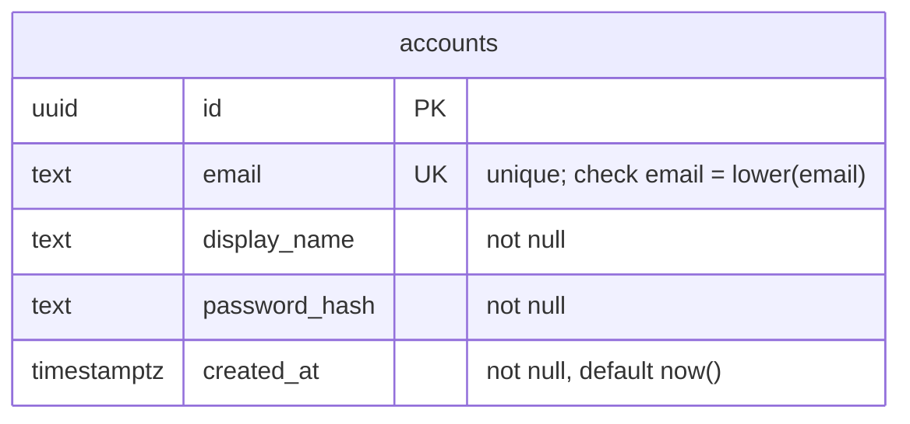
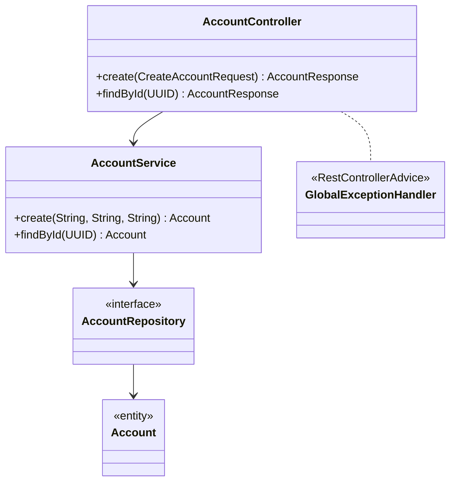

## Context

Ver `proposal.md`. O projeto é um esqueleto Spring Boot sem JPA, sem banco e sem domínio, então esta change instala a camada de persistência inteira junto com a primeira capability.

Restrições que moldam o desenho:
- O parent POM 4.1.1 fixa as versões de JPA, Flyway, Postgres e Testcontainers; só `springdoc` carrega versão própria.
- `KanbanApplicationTests` é `@SpringBootTest`, então qualquer configuração de datasource vale também para o contexto de teste.

## Goals / Non-Goals

**Goals:**
- Uma trilha de persistência que as próximas capabilities reusem sem alteração: Postgres, JPA, Flyway e Testcontainers.
- Erro de API derivado de uma fonte só, sem duplicar a regra de unicidade entre aplicação e banco.

**Non-Goals:**
- `spring-boot-starter-security` e cadeia de filtros. Só o `spring-security-crypto`, pelo `BCryptPasswordEncoder`.
- Perfis de configuração além do padrão.

## Decisions

### Modelo de dados

`created_at` é preenchido pelo default do banco e não entra nos dados públicos.

### Estrutura do pacote

Controller, service, repository, entidade e `AccountNotFoundException` ficam em `com.william.kanban.account`; o `GlobalExceptionHandler` fica em `com.william.kanban.shared`. `CreateAccountRequest` e `AccountResponse` são records; `AccountResponse` expõe `id`, `email` e `display_name`, e `Account` nunca é serializada direto, o que mantém o `password_hash` fora de toda resposta.

### Identificador gerado pela aplicação

`Account` recebe o `UUID` de `UUID.randomUUID()` no construtor, sem `@GeneratedValue`. O insert leva o id pronto, então o service devolve o `Location` sem releitura.

### Normalização e unicidade

O service passa o email por `toLowerCase(Locale.ROOT)` antes de construir a entidade. A unicidade é decidida pelo índice único: o service insere e traduz `DataIntegrityViolationException` em conflito, em vez de consultar antes de gravar. O `CHECK (email = lower(email))` protege o invariante contra gravação por outro caminho.

### Mapeamento de erro

| Situação | Origem | Resposta |
|---|---|---|
| Campo ausente ou email inválido | `MethodArgumentNotValidException` | `400` |
| Email já cadastrado | `DataIntegrityViolationException` | `409` |
| Id inexistente | `AccountNotFoundException` | `404` |
| Id fora do formato uuid | `MethodArgumentTypeMismatchException` | `400` |

Um `@RestControllerAdvice` único para a aplicação, `GlobalExceptionHandler`, converte cada uma em `ProblemDetail`. Ele estende `ResponseEntityExceptionHandler`, que já entrega os dois `400` como `ProblemDetail`, e acrescenta os handlers de `DataIntegrityViolationException` e `AccountNotFoundException`. A validação é declarativa (`@Valid`, `@NotBlank`, `@Email`) e exige `spring-boot-starter-validation` no `pom.xml`, além das dependências listadas na proposal.

### Schema versionado, entidade validada

`V1__create_accounts.sql` cria a tabela em `src/main/resources/db/migration`. `spring.jpa.hibernate.ddl-auto=validate` deixa o Flyway como única origem do schema e faz o contexto falhar quando a entidade e a migration divergem.

### Postgres nos testes

`TestcontainersConfiguration` publica um `@Bean @ServiceConnection PostgreSQLContainer`, importado pelos testes de contexto. A mesma imagem do ambiente de execução responde aos testes, e nenhuma propriedade de conexão é repetida no `src/test/resources`.

`AccountApiTest` cobre os cenários da spec via `MockMvc` sobre o contexto completo. Cada teste limpa a tabela `accounts` antes de rodar, porque o container é único para a suíte.

## Risks / Trade-offs

- `./mvnw test` passa a exigir Docker no ambiente → o README e o `CLAUDE.md` registram o pré-requisito.
- O 409 depende da tradução de `DataIntegrityViolationException`, que é lançada por qualquer violação de constraint da tabela → o handler inspeciona o nome da constraint e só devolve 409 para o índice único de email.
- A aplicação não sobe sem `KANBAN_DB_URL`, `KANBAN_DB_USER` e `KANBAN_DB_PASSWORD` no ambiente → os placeholders ficam sem default, e a falha aparece na criação do `dataSource`, sem citar a variável ausente; o `CLAUDE.md` lista as três. A suíte de teste não depende delas: a conexão vem do `@ServiceConnection`.

## Migration Plan

1. Subir um Postgres para desenvolvimento e exportar `KANBAN_DB_URL`, `KANBAN_DB_USER` e `KANBAN_DB_PASSWORD`.
2. `./mvnw spring-boot:run`: o Flyway aplica `V1__create_accounts.sql` na primeira subida.
3. Rollback: `flyway_schema_history` fica no banco; desfazer é dropar a tabela `accounts` e a linha da versão 1.
