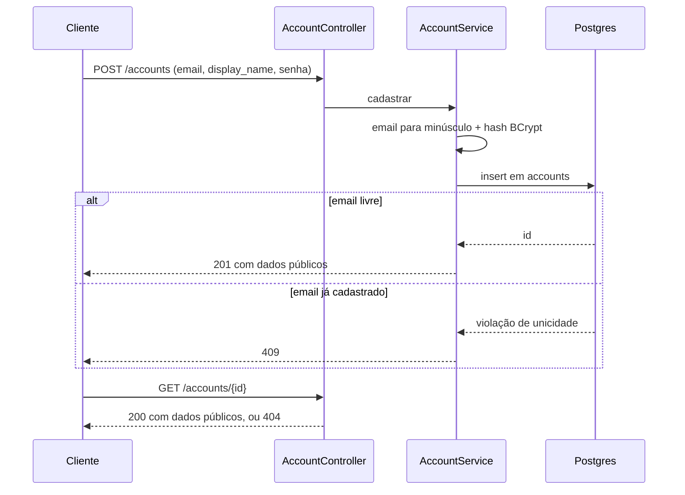

## Why

O kanban não tem identidade de usuário nem persistência. Sem uma conta a que associar dados, não há a que prender board, coluna e card.

## What Changes

- Tabela `accounts` com `id` (uuid), `email`, `display_name` e `password_hash`.
- Dados públicos são `id`, `email` e `display_name`. O `password_hash` não sai em nenhuma resposta.
- Constraint no banco recusa email não normalizado, e um índice único garante a unicidade.
- Persistência com Postgres, acesso via JPA, schema versionado por Flyway e testes contra o mesmo Postgres em Testcontainers.

Fora de escopo: login, sessão, token, proteção de rotas, desativação de conta.

## Capabilities

### New Capabilities
- `account-management`: cadastro e consulta de contas de usuário, com normalização de email, unicidade e armazenamento de senha em hash.

### Modified Capabilities

Nenhuma.

## Impact

- **Código**: pacote `com.william.kanban.account`, com controller, service, repository e entidade.
- **API**: os dois endpoints entram no OpenAPI exposto pelo springdoc.
- **Dependências**: `spring-boot-starter-data-jpa`, driver do Postgres, `flyway-core`, `flyway-database-postgresql` e `spring-security-crypto`; em escopo de teste, `spring-boot-testcontainers`, `org.testcontainers:postgresql` e `org.testcontainers:junit-jupiter`, com versões vindas do BOM do parent.
- **Configuração**: `application.properties` passa a exigir dados de conexão do Postgres; os testes recebem a conexão de um container declarado com `@ServiceConnection`.
- **Testes**: `./mvnw test` passa a exigir Docker, porque `KanbanApplicationTests` é `@SpringBootTest` e sobe o container.
- **Migrations**: `V1__create_accounts.sql`, escrita para Postgres.
