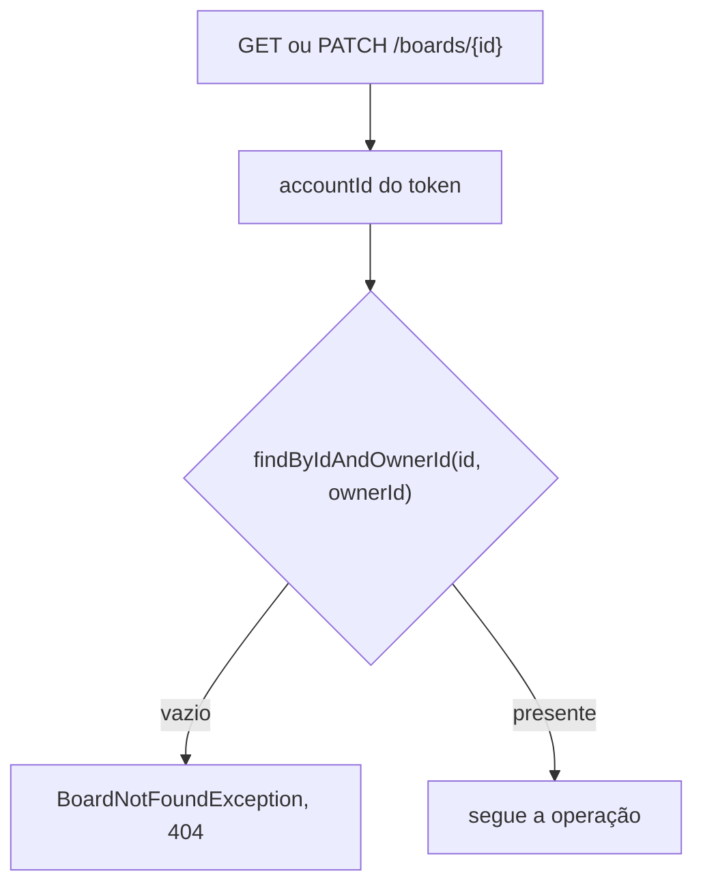
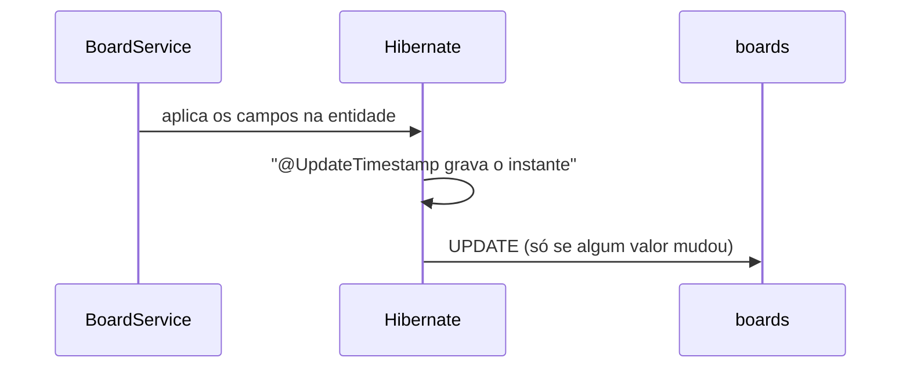
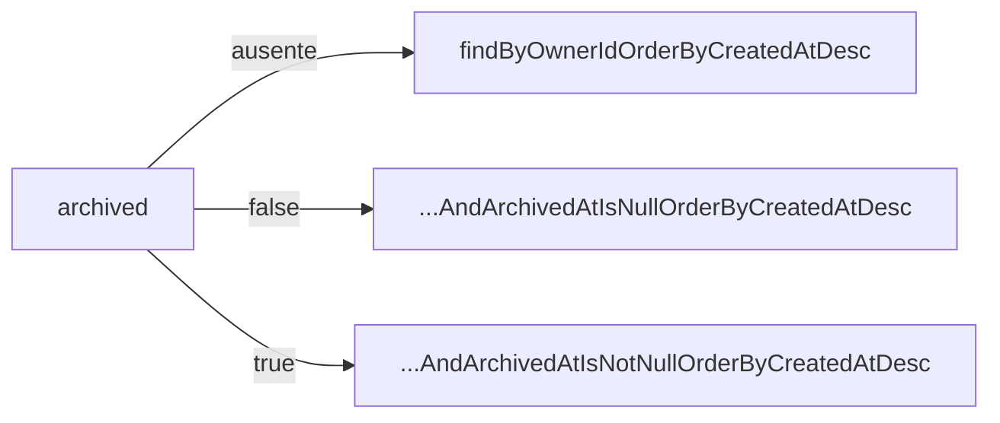

## Context

Ver `proposal.md`, seção Why.

Quatro restrições moldam as decisões abaixo:

- O `accountId` chega ao controller pelo `@AuthenticationPrincipal`, posto pelo `BearerAuthenticationFilter`. Nenhum endpoint de quadro recebe o dono pelo corpo ou pela URL.
- `spring.jpa.hibernate.ddl-auto=validate` obriga a entidade a casar coluna a coluna com a migration.
- O suporte a `java.util.Optional` está no core do Jackson 3, em `tools.jackson.databind.ext.jdk8`.
- `AuthService` grava e compara `expires_at` com o relógio da JVM.

## Goals / Non-Goals

**Goals:**

- O isolamento entre donos é imposto pela consulta, não por comparação depois da leitura.
- O corpo do `PATCH` distingue campo ausente de campo com `null`.
- Todo instante gravado em `boards` vem do mesmo relógio que `AuthService` já usa.

**Non-Goals:**

- Paginação da listagem.
- Quadro compartilhado entre contas.
- Exclusão de quadro e exclusão de conta.
- Migração de `accounts` e `auth_tokens` para o relógio da aplicação.

## Decisions

### O dono entra na consulta

Toda leitura de quadro por id passa por `findByIdAndOwnerId`. Quem implementa não escreve nenhum ramo para `403`, e o `404` de quadro alheio e o de quadro inexistente saem do mesmo caminho, com o mesmo corpo.

Nenhum método público de `BoardService` recebe um id de quadro sem o `accountId` ao lado.

### O corpo do PATCH usa Optional

`UpdateBoardRequest` declara `Optional<String> name`, `Optional<String> description` e `Optional<Boolean> archived`.

| Corpo JSON              | Valor no record      | Efeito                  |
|-------------------------|----------------------|-------------------------|
| campo ausente           | `null`               | não altera o quadro     |
| `"description": null`   | `Optional.empty()`   | grava `null` na coluna  |
| `"description": "x"`    | `Optional.of("x")`   | grava `"x"` na coluna   |

A Bean Validation não alcança o conteúdo de um `Optional`, então os limites de `name` e `description` são verificados dentro de `BoardService`, que lança a exceção convertida em `400`.

### O tempo é carimbado pela aplicação

`createdAt` leva `@CreationTimestamp` com `updatable = false`, e `updatedAt` leva `@UpdateTimestamp`. `archivedAt` é gravado por `BoardService`, do mesmo relógio: as três colunas de `boards` têm uma fonte de tempo só.

As colunas de tempo são `NOT NULL` e não têm `DEFAULT`. Escrita que não passe pela aplicação falha na hora, em vez de gravar uma linha com o tempo errado.

O dirty checking do Hibernate dá o comportamento do `PATCH` sem mudança: sem `UPDATE` emitido, `@UpdateTimestamp` não age e `updated_at` fica intacto.

### A listagem tem três ramos

O parâmetro é `Boolean`, não `boolean`: `@RequestParam(required = false)` deixa `null` no caso ausente. Valor que não converte para booleano vira `MethodArgumentTypeMismatchException`, já tratada pelo `ResponseEntityExceptionHandler` como `400`.

### O booleano da entrada não é a coluna da saída

O corpo do `PATCH` recebe `archived` booleano; a resposta devolve `archived_at`. `BoardService` faz a conversão: `true` grava o instante corrente, `false` grava `null`, e o valor repetido não toca na coluna.

## Risks / Trade-offs

**Risco:** em record, o Jackson pode entregar `Optional.empty()` para campo ausente em vez de `null`, apagando a distinção da tabela acima.
**Mitigação:** a primeira task do `PATCH` é o teste dos três casos (`{}`, `{"description": null}`, `{"description": "x"}`). Se a distinção não se sustentar, o record recebe um wrapper próprio de três estados, sem mexer no contrato HTTP nem nas specs.

**Risco:** a validação de `name` e `description` sai da Bean Validation no `PATCH` e fica no service, enquanto o `POST` continua com as anotações. As duas podem divergir.
**Mitigação:** os limites ficam em constantes de `BoardService`, referenciadas pelas anotações de `CreateBoardRequest`.

**Risco:** com mais de uma instância da aplicação, o instante gravado passa a depender do relógio de cada uma.
**Mitigação:** nenhuma no código. É o preço de ter uma fonte de tempo só, e o desvio entre máquinas sincronizadas por NTP é de milissegundos.

**Risco:** `INSERT` em `boards` por SQL direto falha, porque as colunas de tempo são `NOT NULL` sem `DEFAULT`.
**Mitigação:** nenhuma. É o comportamento desejado.

## Migration Plan

`V3__create_boards.sql` é aditiva: cria `boards` e o índice em `owner_id`, sem tocar em `accounts` nem em `auth_tokens`. Subir a aplicação com a migration aplicada e sem o código do pacote `board` funciona, porque `ddl-auto=validate` só confere as entidades declaradas.

O rollback é uma migration nova com `DROP TABLE boards`; o Flyway community não desfaz versão aplicada.
