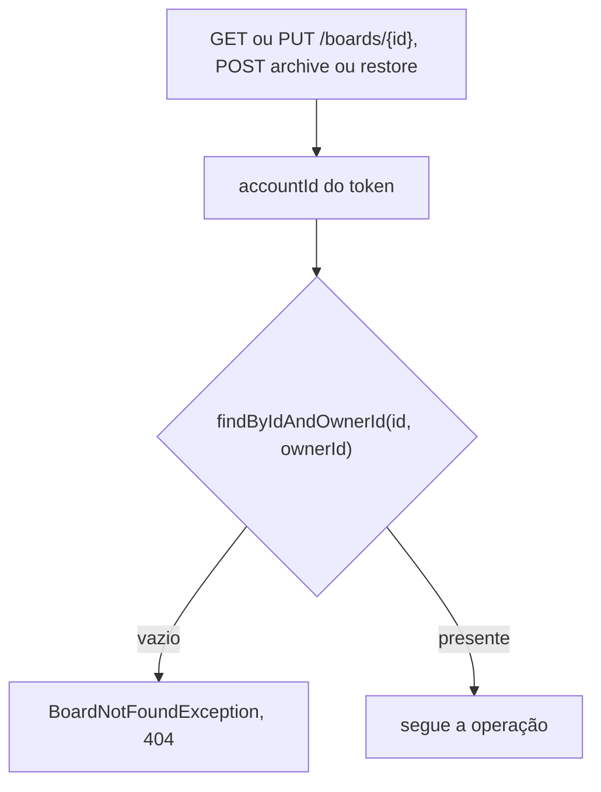
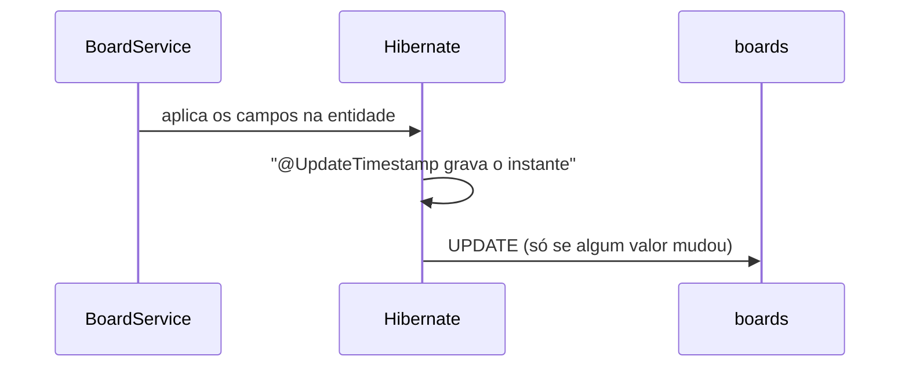
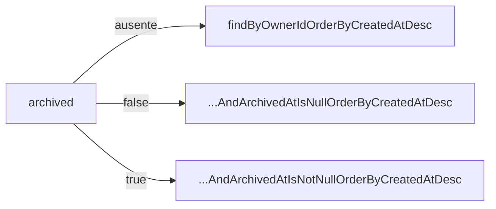

## Context

Ver `proposal.md`, seção Why.

Três restrições moldam as decisões abaixo:

- O `accountId` chega ao controller pelo `@AuthenticationPrincipal`, posto pelo `BearerAuthenticationFilter`. Nenhum endpoint de quadro recebe o dono pelo corpo ou pela URL.
- `spring.jpa.hibernate.ddl-auto=validate` obriga a entidade a casar coluna a coluna com a migration.
- `AuthService` grava e compara `expires_at` com o relógio da JVM.

## Goals / Non-Goals

**Goals:**

- O isolamento entre donos é imposto pela consulta, não por comparação depois da leitura.
- Todo instante gravado em `boards` vem do mesmo relógio que `AuthService` já usa.

**Non-Goals:**

- Paginação da listagem.
- Quadro compartilhado entre contas.
- Exclusão de quadro e exclusão de conta.
- Migração de `accounts` e `auth_tokens` para o relógio da aplicação.

## Decisions

### O dono entra na consulta

Toda leitura de quadro por id passa por `findByIdAndOwnerId`. Quem implementa não escreve nenhum ramo para `403`, e o `404` de quadro alheio e o de quadro inexistente saem do mesmo caminho, com o mesmo corpo.

Nenhum método público de `BoardService` recebe um id de quadro sem o `accountId` ao lado.

### O tempo é carimbado pela aplicação

`createdAt` leva `@CreationTimestamp` com `updatable = false`, e `updatedAt` leva `@UpdateTimestamp`. `archivedAt` é gravado por `BoardService`, do mesmo relógio: as três colunas de `boards` têm uma fonte de tempo só.

As colunas de tempo são `NOT NULL` e não têm `DEFAULT`. Escrita que não passe pela aplicação falha na hora, em vez de gravar uma linha com o tempo errado.

O dirty checking do Hibernate dá o comportamento da requisição sem mudança: sem `UPDATE` emitido, `@UpdateTimestamp` não age e `updated_at` fica intacto.

### A listagem tem três ramos

O parâmetro é `Boolean`, não `boolean`: `@RequestParam(required = false)` deixa `null` no caso ausente. Valor que não converte para booleano vira `MethodArgumentTypeMismatchException`, já tratada pelo `ResponseEntityExceptionHandler` como `400`.

### Arquivar e restaurar não têm corpo

`BoardService.archive` grava o instante corrente em `archivedAt` só quando ele é `null`, e `BoardService.restore` grava `null`. A operação repetida não muda valor nenhum, então não emite `UPDATE` e `updated_at` fica intacto.

## Risks / Trade-offs

**Risco:** `CreateBoardRequest` e `UpdateBoardRequest` carregam as mesmas regras de validação e podem divergir.
**Mitigação:** os limites ficam em constantes de `BoardLimits`, referenciadas pelas anotações dos dois records.

**Risco:** com mais de uma instância da aplicação, o instante gravado passa a depender do relógio de cada uma.
**Mitigação:** nenhuma no código. É o preço de ter uma fonte de tempo só, e o desvio entre máquinas sincronizadas por NTP é de milissegundos.

**Risco:** `INSERT` em `boards` por SQL direto falha, porque as colunas de tempo são `NOT NULL` sem `DEFAULT`.
**Mitigação:** nenhuma. É o comportamento desejado.

## Migration Plan

`V3__create_boards.sql` é aditiva: cria `boards` e o índice em `owner_id`, sem tocar em `accounts` nem em `auth_tokens`. Subir a aplicação com a migration aplicada e sem o código do pacote `board` funciona, porque `ddl-auto=validate` só confere as entidades declaradas.

O rollback é uma migration nova com `DROP TABLE boards`; o Flyway community não desfaz versão aplicada.
