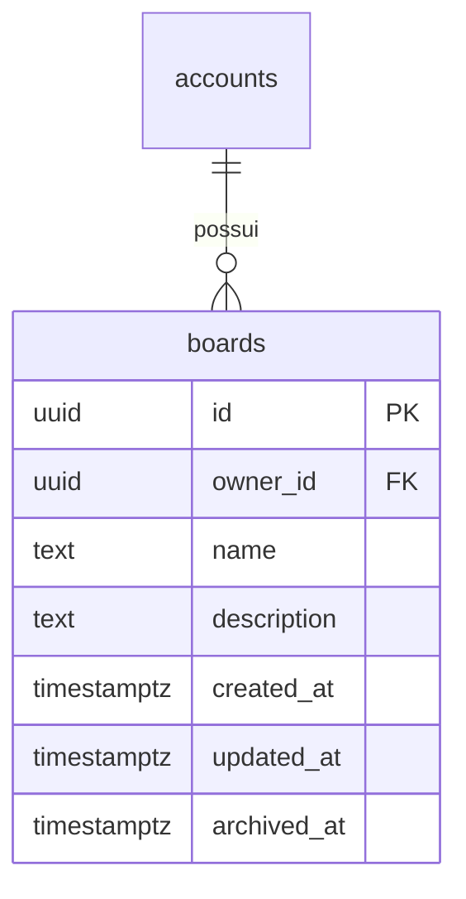
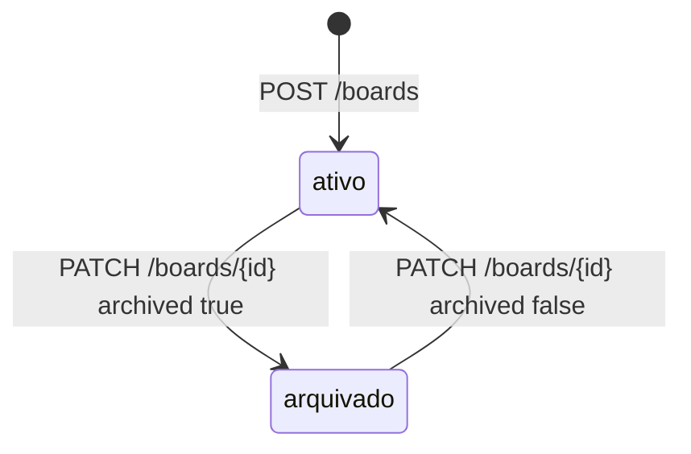

## Why

Uma conta autenticada não tem nenhum recurso próprio no sistema. Sem quadro, não há onde pendurar coluna nem card.

## What Changes

- `POST /boards` responde `201` com `id`, `name`, `description`, `created_at`, `updated_at` e `archived_at`, e grava como dono a conta do token.
- `name` é obrigatório e não vazio, com no máximo 100 caracteres; `description` é opcional, com no máximo 500. Entrada inválida responde `400`.
- `GET /boards` responde `200` com todos os quadros do dono do token, ordenados por `created_at` do mais recente para o mais antigo. `archived=false` restringe aos ativos e `archived=true` aos arquivados; valor fora desses dois responde `400`.
- `GET /boards/{id}` responde `200` com o quadro, ativo ou arquivado.
- `PATCH /boards/{id}` altera somente os campos presentes no corpo e responde `200` com o quadro atualizado. Corpo sem nenhum campo responde `200` sem alterar o quadro.
- `name` presente com `null`, vazio ou acima de 100 caracteres responde `400`. `description` presente com `null` apaga a descrição.
- `archived` igual a `true` carimba `archived_at`; igual a `false` grava `null`. Repetir o valor atual responde `200` sem alterar `archived_at`.
- Quadro de outra conta responde `404` em `GET /boards/{id}` e `PATCH /boards/{id}`, com o mesmo corpo de quadro inexistente.
- Alterar um quadro carimba `updated_at`. `PATCH` que não muda nenhum valor deixa `updated_at` intacto.
- Excluir a linha da conta em `accounts` apaga os quadros dela.
- Os endpoints de quadro aparecem no documento OpenAPI com os códigos de resposta que produzem.

## Capabilities

### New Capabilities

- `board-management`: criação, consulta, edição e arquivamento de quadros de uma conta, com isolamento entre donos.

### Modified Capabilities

Nenhuma.

## Impact

- Pacote novo `com.william.kanban.board`, com `Board`, `BoardRepository`, `BoardService`, `BoardController`, `BoardNotFoundException` e os records `CreateBoardRequest`, `UpdateBoardRequest` e `BoardResponse`.
- Endpoints novos: `POST /boards`, `GET /boards`, `GET /boards/{id}`, `PATCH /boards/{id}`. Todos exigem token.
- Migration `V3__create_boards.sql`: tabela `boards`, chave estrangeira `owner_id` para `accounts (id)` com `ON DELETE CASCADE`, índice em `owner_id`. As colunas de tempo são `NOT NULL` e não têm `DEFAULT`.
- `GlobalExceptionHandler` passa a converter `BoardNotFoundException` em `404`.
- Nenhuma dependência nova no `pom.xml`.
