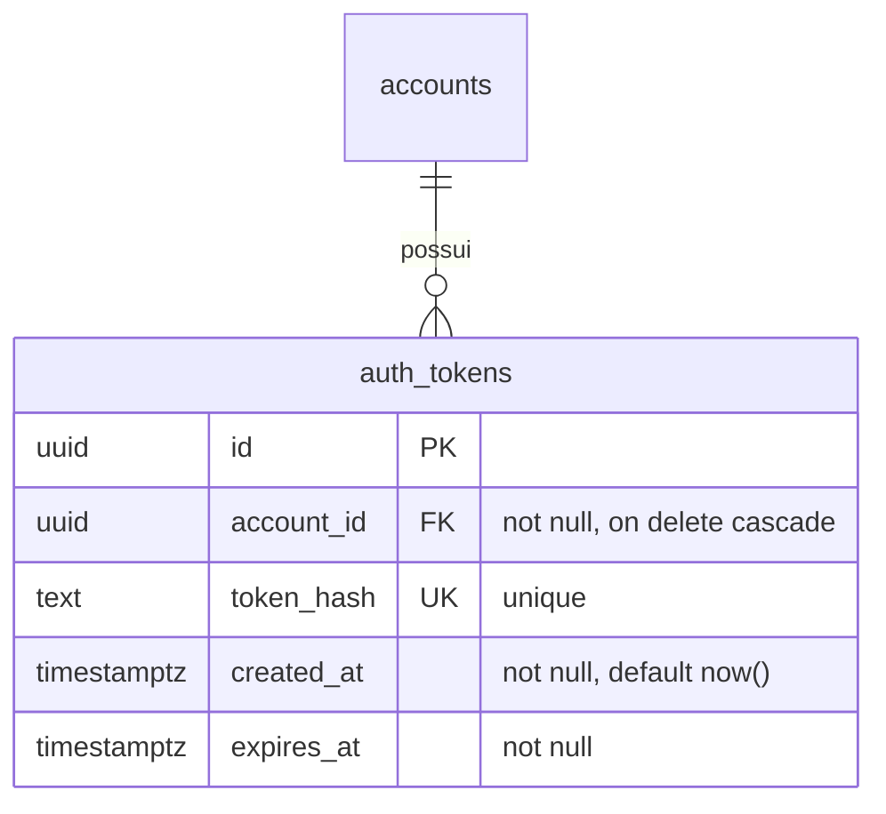
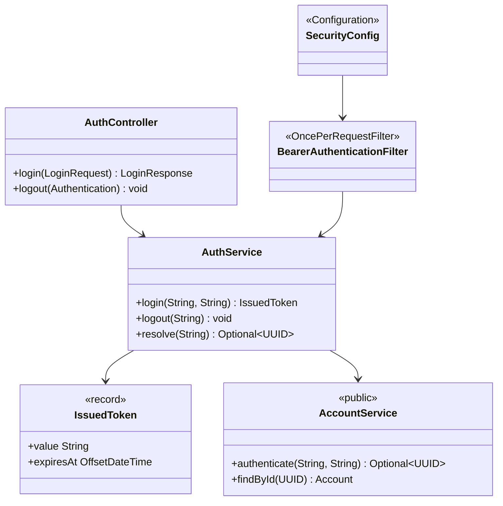
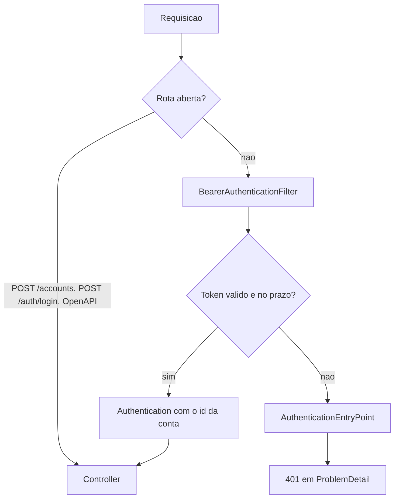

## Context

Ver `proposal.md`. A aplicação não tem cadeia de filtros: `spring-security-crypto` entra só pelo `BCryptPasswordEncoder`, instanciado dentro de `AccountService`.

Restrições que moldam o desenho:
- Toda classe de `com.william.kanban.account` é package-private, menos `AccountNotFoundException`; o pacote novo alcança só o que for promovido a público.
- Todo branch precisa de um teste que o percorra: branch inalcançável reprova os gates de 80%.

## Goals / Non-Goals

**Goals:**
- Rota não aberta chega ao controller com o UUID resolvido; board, coluna e card o reusam.
- A linha em `auth_tokens` é a única fonte da sessão: apagá-la invalida o token na requisição seguinte.

**Non-Goals:**
- Refresh token e renovação deslizante do prazo.
- Limite de tentativas de login.
- Rotina de limpeza de token expirado.
- Autorização por papel ou por dono do recurso: a cadeia só distingue autenticado de anônimo.
- HATEOAS nas respostas.

## Decisions

### Modelo de dados

Todo token pertence a exatamente uma conta, pela chave estrangeira, e apagada a conta somem todos os seus tokens, pelo `ON DELETE CASCADE`. Cada login insere uma linha; cada logout apaga a linha que a própria requisição usou. Revogação sem coluna de estado.

### Token opaco, hash na tabela

O token são 256 bits de `SecureRandom`, codificados em Base64 url-safe sem padding. A tabela guarda o SHA-256 desse valor, e toda busca por requisição usa o índice único de `token_hash`.

Exatamente uma resposta traz o token em claro: a do login. Token perdido não é reemitido. O SHA-256 basta porque o valor é aleatório de 256 bits, sem o espaço de busca reduzido de uma senha escolhida por pessoa.

### Fronteira entre os pacotes

`AccountService` é a única classe de `account` que passa a pública, e `authenticate` o único método novo exposto. Nenhuma classe de `auth` alcança `Account`, `AccountRepository` ou os records: o `password_hash` não sai do pacote `account`.

`AuthToken` guarda o hash, então o valor em claro sai do service no record `IssuedToken`, e `AuthController` monta o `LoginResponse` com o `token_type`.

O `Authentication` que o filtro cria carrega o `UUID` da conta como principal e o token como credentials. `AccountController` recebe o id por `@AuthenticationPrincipal` e `AuthController.logout` lê o token das credentials: nenhum dos dois lê o header, e o documento OpenAPI não declara `Authorization` como parâmetro de operação.

### Cadeia de filtros

As rotas abertas são `POST /accounts`, `POST /auth/login`, `/v3/api-docs/**`, `/swagger-ui/**` e `/swagger-ui.html`. Toda rota fora dessa lista exige token. Um token vale quando existe linha em `auth_tokens` com o hash recebido e `expires_at` no futuro; em todo outro caso a resposta é 401.

A `SecurityFilterChain` fica em `SecurityConfig`, com `csrf` desligado, `SessionCreationPolicy.STATELESS`, `httpBasic` e `formLogin` desligados. `KanbanApplication` exclui `UserDetailsServiceAutoConfiguration`: desligar as duas formas de autenticação não impede a subida de gerar o usuário `user` com senha aleatória.

O `AuthenticationEntryPoint` do projeto serializa um `ProblemDetail` 401 com o `ObjectMapper` da aplicação. Sem ele a cadeia responde 403 com corpo vazio, fora do formato de erro do resto da API.

A documentação OpenAPI entra na lista de rotas abertas junto do cadastro e do login: a API é pública, e o documento é o que um integrador lê antes de ter conta.

### Custo constante no login

Com email não cadastrado, `AccountService.authenticate` roda `BCryptPasswordEncoder.matches` contra um hash fixo antes de devolver vazio. O tempo de resposta fica igual nos dois casos, e o 401 idêntico não entrega quais emails existem.

### Prazo por propriedade

`expires_at` é `created_at` mais o valor de `kanban.auth.token-ttl`, que fica no `application.properties` com default `24h` e é lido como `Duration`. Prazo de sessão não é segredo e não entra nas variáveis de ambiente, que derrubam a subida quando faltam.

### Consulta por id fora da API, dentro do service

`AccountService.findById` lança `AccountNotFoundException` para id desconhecido, e o `GlobalExceptionHandler` traduz em 404. Nenhum endpoint recebe id de conta, então esse 404 não entra no OpenAPI; a exceção é coberta por teste direto do service, sem caminho morto para o gate de mutação.

### Autenticação nos testes

`AuthApiTest` e os testes de `/accounts/me` obtêm o token chamando `POST /auth/login`, sem `@WithMockUser` e sem dependência de teste nova. O cenário de token expirado ajusta o `expires_at` da linha direto no banco, porque o prazo de 24 horas não cabe na suíte.

## Risks / Trade-offs

- Toda requisição a rota não aberta faz um `select` em `auth_tokens` → a busca é pelo índice único de `token_hash`, com uma linha por login vivo.
- Nenhuma rotina apaga token vencido → toda linha vencida é recusada pela comparação com `expires_at`, e cada uma ocupa cerca de cem bytes.
- Toda rota fora da lista de abertas nasce bloqueada → o default da cadeia é `authenticated()`, e a lista fica em um lugar só, em `SecurityConfig`.
- Nenhuma resposta reemite o token → o cliente que o perde faz login de novo, e o front trata 401 refazendo o login.

## Migration Plan

1. `./mvnw spring-boot:run`: o Flyway aplica `V2__create_auth_tokens.sql` na subida.
2. O cliente troca `GET /accounts/{id}` por `POST /auth/login` seguido de `GET /accounts/me` com o header `Authorization: Bearer <token>`.
3. Rollback: dropar a tabela `auth_tokens` e a linha da versão 2 em `flyway_schema_history`.
