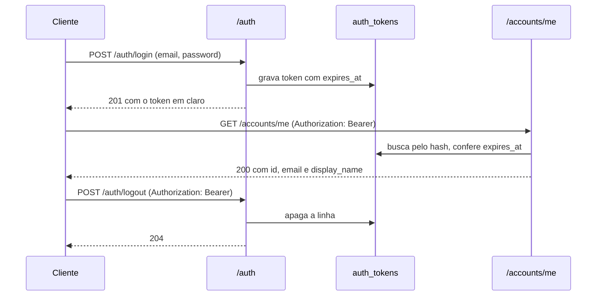

## Why

As contas existem, mas nenhuma requisição sabe quem a fez: todo endpoint é aberto e nenhum recurso pode pertencer a alguém. Board, coluna e card dependem de um dono identificado a cada chamada.

## What Changes

- `POST /auth/login` devolve 201 com um token opaco de validade 24 horas, e 401 quando o email não existe ou a senha não confere, com a mesma resposta nos dois casos.
- `POST /auth/logout` apaga o token usado na própria chamada e responde 204; o token deixa de valer na requisição seguinte.
- Cada login gera um token independente: entrar de novo não derruba a sessão anterior.
- O token trafega no header `Authorization: Bearer`, é gerado por `SecureRandom` e fica no banco apenas como hash SHA-256.
- Requisição sem token, com token desconhecido ou com token expirado responde 401 em `ProblemDetail`.
- **BREAKING** `GET /accounts/{id}` sai e `GET /accounts/me` entra, servindo a conta do token.
- **BREAKING** `POST /accounts` responde 201 sem header `Location`.
- `POST /accounts`, `POST /auth/login` e a documentação OpenAPI continuam abertos; todo o resto exige token.

## Capabilities

### New Capabilities
- `authentication`: emissão, validação e revogação do token que identifica a conta em cada requisição.

### Modified Capabilities
- `account-management`: a consulta por id vira consulta da conta autenticada, e o cadastro deixa de devolver `Location`.

## Impact

- Novo pacote `com.william.kanban.auth`, com controller, service, entidade de token, repositório, filtro de autenticação e configuração da cadeia de filtros.
- Endpoints: `POST /auth/login` e `POST /auth/logout` criados, `GET /accounts/me` criado, `GET /accounts/{id}` removido.
- `pom.xml`: entra `org.springframework.boot:spring-boot-starter-security`, sai `org.springframework.security:spring-security-crypto`.
- Migration `V2__create_auth_tokens.sql`, com a tabela `auth_tokens` e chave estrangeira para `accounts`.
- `application.properties`: propriedade `kanban.auth.token-ttl`, com default de 24 horas.
- `GlobalExceptionHandler` passa a traduzir a falha de credencial em 401.
- `AccountApiTest` perde os testes de consulta por id e ganha os de `/accounts/me`; nova classe `AuthApiTest`.
- `README.md` e `CLAUDE.md` registram o fluxo de login e a troca de dependência.
