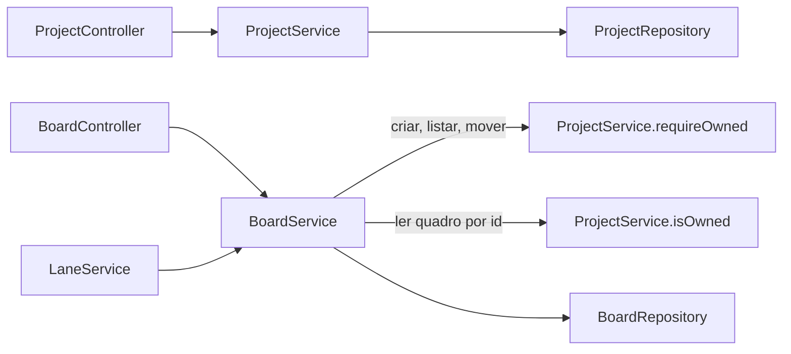
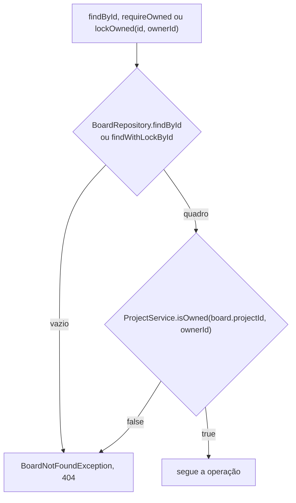
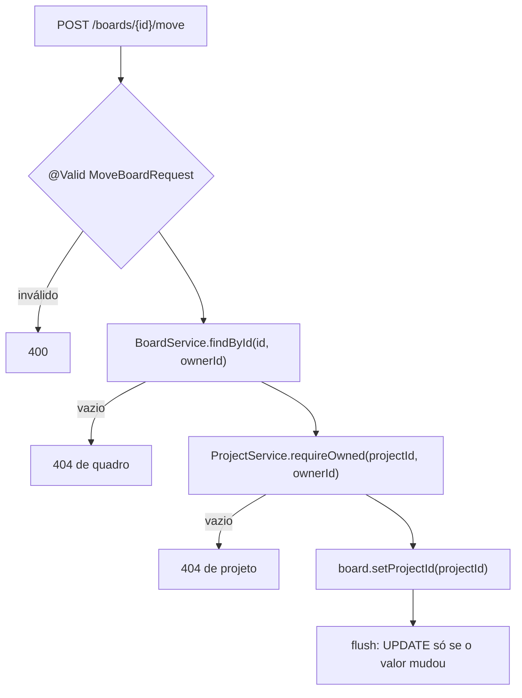

## Context

Ver `proposal.md`, seção Why, e as specs `project-management` e `board-management` desta change para os comportamentos.

Duas restrições moldam as decisões abaixo:

- `LaneService` chama `BoardService.requireOwned(boardId, ownerId)` e `BoardService.lockOwned(boardId, ownerId)` antes de tocar em `lanes`.
- Sem `@DynamicUpdate`, o flush de uma entidade emite `UPDATE` com todas as colunas.

## Goals / Non-Goals

**Goals:**

- Só `ProjectService` decide se uma conta é dona de um projeto, inclusive quando a pergunta chega por um quadro.
- O pacote `lane` não muda.

**Non-Goals:**

- Membros de projeto e colaboração entre contas.
- Exclusão de projeto.
- Paginação das listagens de projetos e de quadros.

## Decisions

### O pacote `board` pergunta ao `ProjectService`



O pacote `project` espelha o `board`, e `ProjectService` é pública com dois métodos públicos:

| Método | Retorno | Projeto inexistente ou de outra conta |
|---|---|---|
| `isOwned(UUID id, UUID ownerId)` | `boolean`, por `ProjectRepository.existsByIdAndOwnerId` | `false` |
| `requireOwned(UUID id, UUID ownerId)` | `void` | lança `ProjectNotFoundException` |

`ProjectNotFoundException` é pública com construtor package-private, e `ProjectLimits` repete os limites de `BoardLimits` em constantes próprias. O pacote `project` não importa nada de `board`.

### A posse do quadro é conferida em dois passos



`BoardRepository` fica com o `findById` herdado e com `findWithLockById`, anotado com `@Lock(LockModeType.PESSIMISTIC_WRITE)`; os finders por `owner_id` saem. `findById`, `requireOwned` e `lockOwned` de `BoardService` mantêm a assinatura e respondem o `404` de quadro nos dois ramos, então `LaneService` segue igual.

As listagens de quadro usam `requireOwned` do projeto e depois os finders por `project_id`, nos três ramos de `archived` que a listagem de quadros já usa: `findByProjectIdOrderByCreatedAtDesc` e as variantes com `ArchivedAtIsNull` e `ArchivedAtIsNotNull`.

### Rotas de quadro sem prefixo de classe

`BoardController` perde o `@RequestMapping("/boards")` de classe, e cada método declara o caminho inteiro: `/projects/{projectId}/boards` para criar e listar, `/boards/{id}` e derivados para o resto. `ProjectController` fica com `@RequestMapping("/projects")`.

### A movimentação confere o quadro antes do destino



`BoardService.move` é `@Transactional` e usa `findById`, sem trava, como `update`, `archive` e `restore`. Quadro alheio com destino inexistente responde o `404` de quadro, porque a checagem do quadro vem primeiro. Destino igual ao atual não suja a entidade, então não há `UPDATE` nem carimbo.

`MoveBoardRequest` declara `@NotNull @JsonProperty("project_id") UUID projectId`. Valor fora do formato `uuid` falha na desserialização e cai no `400` do `ResponseEntityExceptionHandler`.

`BoardService.create` recebe `projectId` e `ownerId` e chama `ProjectService.requireOwned` antes do `save`. `Board` troca `ownerId` por `projectId` e ganha `setProjectId`.

## Risks / Trade-offs

**Risco:** `lockOwned` trava a linha do quadro antes de conferir o dono, e uma requisição de lane de outra conta segura a trava até responder `404`.
**Mitigação:** nenhuma. A espera dura uma transação que só executa uma consulta em `boards` e outra em `projects`.

**Risco:** `PUT /boards/{id}` e `POST /boards/{id}/move` simultâneos no mesmo quadro emitem `UPDATE` com todas as colunas, e o último flush desfaz a alteração do outro.
**Mitigação:** nenhuma. A mesma corrida vale entre `PUT /boards/{id}` e `archive`.

## Migration Plan

`V5__create_projects.sql` é aditiva. `V6__add_project_to_boards.sql` adiciona `project_id` `NOT NULL` sem `DEFAULT` e falha em banco com linha em `boards`.

O Postgres de desenvolvimento é zerado antes de subir a aplicação com a `V6`:

```bash
docker compose rm -sf postgres
docker volume rm kanban_kanban-pgdata
docker compose up -d
```

O rollback é uma migration nova que remove `project_id` de `boards`, recria `owner_id` e apaga `projects`, também sobre `boards` vazia.
