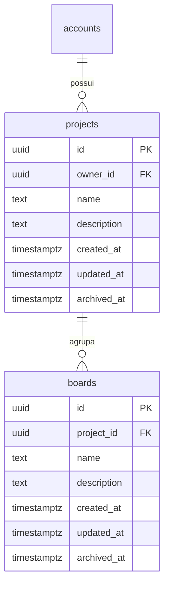
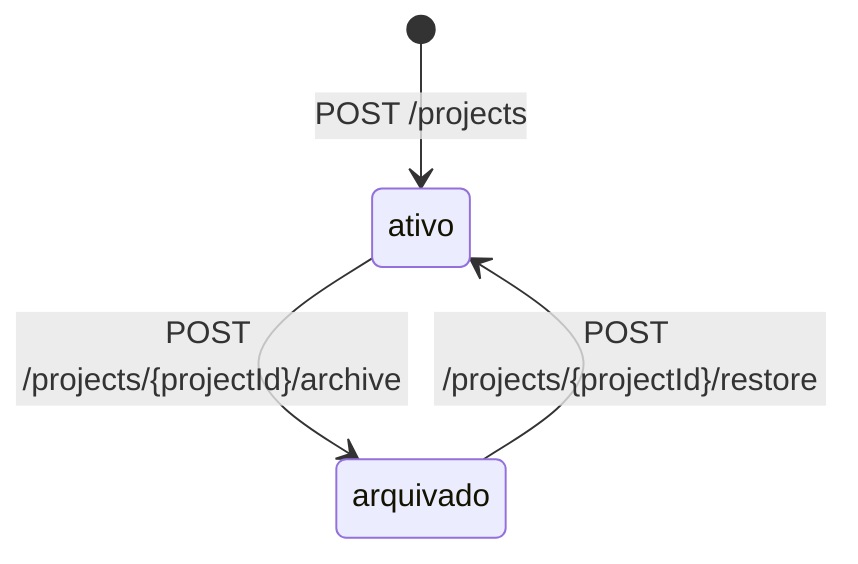

## Why

Os quadros de uma conta formam uma lista única, sem agrupamento. Não há onde reunir os quadros de um mesmo trabalho.

## What Changes

- `POST /projects` responde `201` com `id`, `name`, `description`, `created_at`, `updated_at` e `archived_at`, e grava como dono a conta do token.
- `name` do projeto é obrigatório e não vazio, com no máximo 100 caracteres; `description` é opcional, com no máximo 500. Entrada inválida responde `400`.
- `GET /projects` responde `200` com os projetos do dono do token, por `created_at` do mais recente para o mais antigo. `archived=false` restringe aos ativos e `archived=true` aos arquivados; valor fora desses dois responde `400`.
- `GET /projects/{projectId}` responde `200` com o projeto, ativo ou arquivado.
- `PUT /projects/{projectId}` substitui `name` e `description`, com as regras de validação do `POST /projects`, e responde `200`. `description` ausente ou `null` grava `null`, e `archived_at` não muda.
- `POST /projects/{projectId}/archive` carimba `archived_at` e `POST /projects/{projectId}/restore` grava `null`; os dois respondem `200` com o projeto. Arquivar projeto arquivado ou restaurar projeto ativo responde `200` sem alterar `archived_at`.
- Arquivar ou restaurar um projeto não altera os quadros dele. Projeto arquivado aceita todas as operações de quadro.
- Projeto inexistente ou de outra conta responde `404` em todo endpoint com `{projectId}`, com o mesmo corpo de projeto inexistente.
- Alterar um projeto carimba `updated_at`. Requisição que não muda nenhum valor deixa `updated_at` intacto.
- **BREAKING** `POST /boards` e `GET /boards` deixam de existir.
- `POST /projects/{projectId}/boards` recebe `name` e `description`, com as regras de validação de quadro, e responde `201` com o quadro criado no projeto da URL.
- `GET /projects/{projectId}/boards` responde `200` com os quadros do projeto, por `created_at` do mais recente para o mais antigo, com o mesmo filtro `archived` de `GET /projects`.
- Toda resposta de quadro traz `project_id`.
- `POST /boards/{id}/move` recebe `project_id` e responde `200` com o quadro no projeto de destino. `project_id` ausente, `null` ou fora do formato `uuid` responde `400`; destino inexistente ou de outra conta responde `404` de projeto; destino igual ao projeto atual responde `200` sem alterar o quadro. As lanes acompanham o quadro.
- Quadro cujo projeto é de outra conta responde `404` em `GET /boards/{id}`, `PUT /boards/{id}`, `POST /boards/{id}/archive`, `POST /boards/{id}/restore`, `POST /boards/{id}/move` e em todo endpoint de lane, com o mesmo corpo de quadro inexistente.
- Excluir a linha da conta em `accounts` apaga os projetos dela, e excluir a linha do projeto em `projects` apaga os quadros dele.
- Os endpoints de projeto e os de quadro aparecem no documento OpenAPI com os códigos de resposta que produzem.

## Capabilities

### New Capabilities

- `project-management`: criação, consulta, edição e arquivamento de projetos de uma conta, com isolamento entre donos.

### Modified Capabilities

- `board-management`: o quadro é criado e listado dentro de um projeto, pertence à conta pelo projeto e muda de projeto por `POST /boards/{id}/move`.

## Impact

- Pacote novo `com.william.kanban.project`, com `Project`, `ProjectRepository`, `ProjectService`, `ProjectController`, `ProjectNotFoundException`, `ProjectLimits` e os records `CreateProjectRequest`, `UpdateProjectRequest` e `ProjectResponse`.
- Pacote `board`: `Board` troca `ownerId` por `projectId`, `BoardService` confere o dono pelo `ProjectService`, `BoardResponse` ganha `project_id` e entra o record `MoveBoardRequest`.
- Endpoints novos: `POST /projects`, `GET /projects`, `GET /projects/{projectId}`, `PUT /projects/{projectId}`, `POST /projects/{projectId}/archive`, `POST /projects/{projectId}/restore`, `POST /projects/{projectId}/boards`, `GET /projects/{projectId}/boards` e `POST /boards/{id}/move`. Todos exigem token.
- Endpoints removidos: `POST /boards` e `GET /boards`.
- Migration `V5__create_projects.sql`: tabela `projects`, chave estrangeira `owner_id` para `accounts (id)` com `ON DELETE CASCADE`, índice em `owner_id`. As colunas de tempo são `NOT NULL` e não têm `DEFAULT`.
- Migration `V6__add_project_to_boards.sql`: `boards` perde `owner_id` e ganha `project_id` `NOT NULL`, com chave estrangeira para `projects (id)` com `ON DELETE CASCADE` e índice. Ela só se aplica com `boards` vazia.
- `GlobalExceptionHandler` passa a converter `ProjectNotFoundException` em `404`.
- Nenhuma dependência nova no `pom.xml`.
