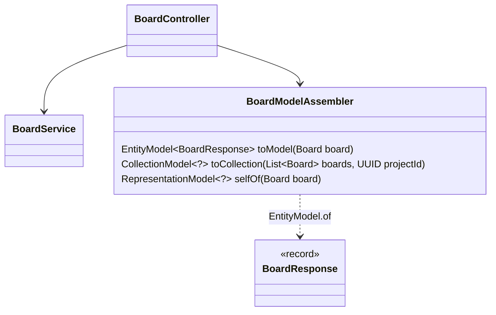
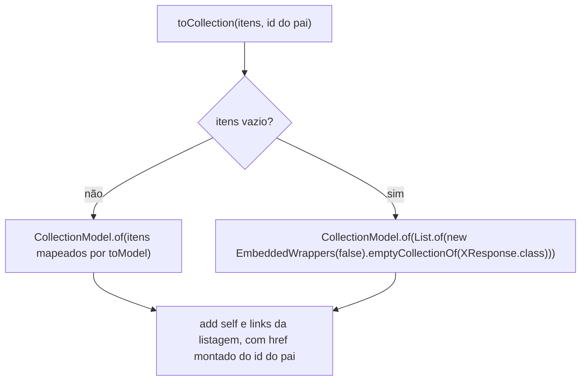
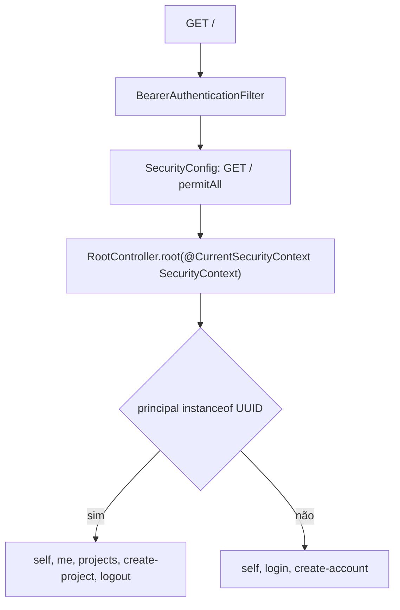
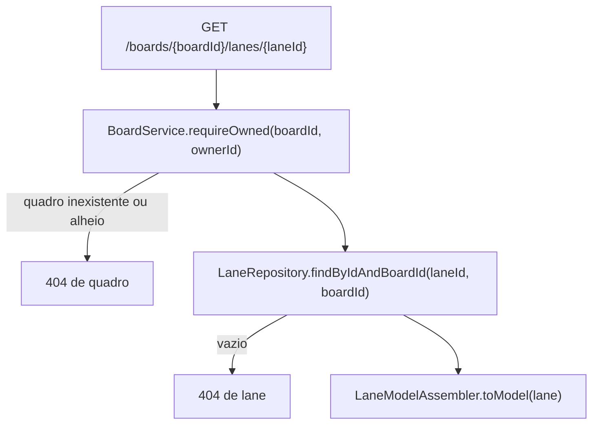

## Context

Ver `proposal.md`, seção Why, e as specs desta change para os comportamentos.

Três restrições moldam as decisões abaixo:

- `OpenApiResponsesConfig` documenta `401` para todo handler com parâmetro `@AuthenticationPrincipal` ou do tipo `Authentication`.
- `BearerAuthenticationFilter` não grava autenticação quando o token é desconhecido, expirado ou vem em outro formato, e a rota aberta segue com a autenticação anônima do Spring Security.
- Controllers, records de resposta e entidades são package-private.

## Goals / Non-Goals

**Goals:**

- Cada pacote monta os links dos próprios recursos, com `href` escrito como caminho literal, sem importar controller de outro pacote.
- Repositórios mantêm as assinaturas. Nos serviços, o único método novo é `LaneService.findById`, e `LaneService.reorder` e `AccountService.create` devolvem `void`, porque o controller não lê mais o retorno.

**Non-Goals:**

- HAL-FORMS.
- Paginação das listagens.
- Links condicionados a permissão.

## Decisions

### Um assembler por pacote de recurso

`ProjectModelAssembler` e `LaneModelAssembler` têm a mesma forma, e o `toResponse` de cada controller muda para o assembler. `LaneModelAssembler.selfOf(Lane)` usa `lane.getBoardId()`, e `LaneModelAssembler.selfOfCollection(UUID boardId)` atende `PUT /boards/{boardId}/lanes/order`. Os assemblers são `@Component` package-private e não implementam `RepresentationModelAssembler`.

Cada link é `Link.of("/boards/" + id + "/archive", "archive")`. `WebMvcLinkBuilder` fica de fora, porque grava esquema e host no `href`.

Os records de resposta ganham `@Relation(collectionRelation = "projects")`, `"boards"` e `"lanes"`, que dão o nome do array em `_embedded`.

### Retorno dos handlers

| Handler | Retorno |
|---|---|
| consulta por id | `EntityModel<XResponse>` |
| listagem | `CollectionModel<?>` |
| criação | `ResponseEntity<RepresentationModel<?>>`, por `ResponseEntity.created` com a URI do `self` |
| outra escrita | `RepresentationModel<?>` |

As criações mantêm `@ResponseStatus(HttpStatus.CREATED)` junto do `ResponseEntity`: sem a anotação, o springdoc documenta `200`. Nas escritas que devolvem a entidade, o controller usa dela só o que o `selfOf` pede.

### Coleção vazia mantém o array

`CollectionModel.of` sem item omite `_embedded`, e o wrapper vazio força o array com o nome do `@Relation`. O `self` da listagem vem do id do pai, então a query string de `archived` nunca entra no `href`.

### Conta e login montam os links no controller

`AccountController` e `AuthController` não têm assembler: os links deles são fixos. `GET /accounts/me` devolve `EntityModel.of(response, links)`, `POST /accounts` devolve `ResponseEntity.created(URI.create("/accounts/me"))` com `new RepresentationModel<>(links)`, e `POST /auth/login` devolve `EntityModel.of(loginResponse, links)` com o `@ResponseStatus(HttpStatus.CREATED)` atual.

### Ponto de entrada lê o contexto de segurança

`RootController` fica em `shared` e devolve `RepresentationModel<?>`. `@CurrentSecurityContext` não é `@AuthenticationPrincipal` nem `Authentication`, então o `OpenApiResponsesConfig` não documenta `401` em `GET /` e continua sem alteração.

### Consulta de lane confere o quadro antes da lane

`LaneService.findById` não abre transação nem trava o quadro, como `LaneService.list`, e reaproveita o `findInBoard` privado.

## Risks / Trade-offs

**Risco:** o `Location` relativo quebra cliente HTTP que só aceita URI absoluta.
**Mitigação:** nenhuma.

**Trade-off:** ler o recurso depois de uma escrita exige um `GET` a mais.

## Migration Plan

Nenhuma migration de banco. O deploy troca o formato de todas as respostas de sucesso de uma vez, e o rollback é o deploy da versão anterior.
