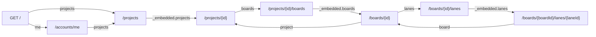

## Why

Um cliente da API precisa conhecer cada rota de antemão e deduzir sozinho quais operações cabem no estado de cada recurso. Não há como consultar uma lane isolada.

## What Changes

- **BREAKING** Toda resposta de sucesso com corpo sai em HAL, com `Content-Type` `application/hal+json` e `href` relativo à raiz.
- **BREAKING** Listagens respondem um objeto com os itens em `_embedded.projects`, `_embedded.boards` ou `_embedded.lanes`, com array vazio quando não há item.
- **BREAKING** Escritas de projeto, quadro e lane respondem só `_links`, sem campo do recurso. As criações levam o header `Location` igual ao `self`.
- **BREAKING** `POST /accounts` responde `201` só com `_links` e com `Location` igual a `/accounts/me`.
- `GET /accounts/me` e `POST /auth/login` ganham `_links`.
- Cada projeto, quadro e lane traz um link para cada endpoint que opera sobre ele. `archive` aparece só no recurso ativo e `restore` só no arquivado.
- `GET /` responde `200` sem exigir token, com links que dependem de a requisição trazer token válido.
- `GET /boards/{boardId}/lanes/{laneId}` responde `200` com a lane, ativa ou arquivada.
- Respostas de erro continuam em `ProblemDetail`, sem `_links`.

## Capabilities

### New Capabilities

- `api-hypermedia`: formato HAL das respostas, coleções em `_embedded`, respostas de escrita só com links e o ponto de entrada `GET /`.

### Modified Capabilities

- `account-management`: `POST /accounts` responde só com links e `Location`, e `GET /accounts/me` traz links.
- `authentication`: `POST /auth/login` traz links, e `GET /` passa a ser endpoint aberto.
- `project-management`: escritas respondem só com links, a listagem sai em `_embedded` e o projeto traz links.
- `board-management`: escritas respondem só com links, a listagem sai em `_embedded` e o quadro traz links.
- `lane-management`: escritas respondem só com links, a listagem sai em `_embedded`, a lane traz links e ganha `GET /boards/{boardId}/lanes/{laneId}`.

## Impact

- `pom.xml`: dependência `org.springframework.boot:spring-boot-starter-hateoas`, com a versão do parent POM.
- Pacotes `project`, `board` e `lane`: entram `ProjectModelAssembler`, `BoardModelAssembler` e `LaneModelAssembler`; `ProjectResponse`, `BoardResponse` e `LaneResponse` ganham `@Relation`; os controllers devolvem modelos HAL.
- Pacote `lane`: `LaneService.findById` e `GET /boards/{boardId}/lanes/{laneId}`.
- Pacotes `account` e `auth`: `AccountController` e `AuthController` devolvem modelos HAL.
- Pacote `shared`: `RootController`, com `GET /`.
- `SecurityConfig`: `GET /` sem token.
- Nenhuma migration.
