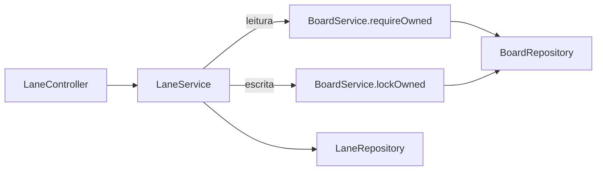
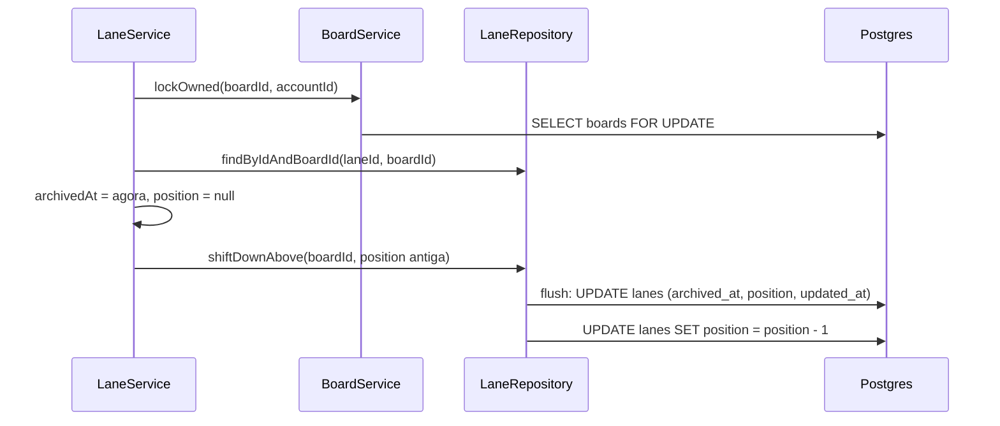
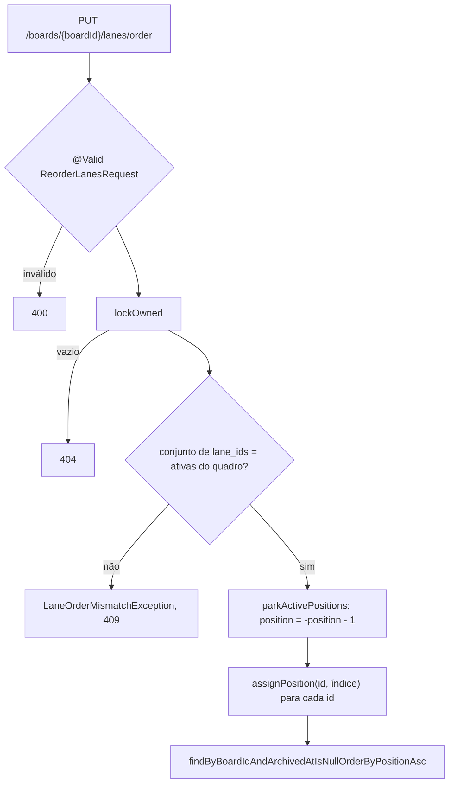

## Context

Ver `proposal.md`, seção Why, e `specs/lane-management/spec.md` para os comportamentos.

Quatro restrições moldam as decisões abaixo:

- Todas as classes do pacote `board` são package-private.
- O Postgres confere restrição única não-deferrable a cada linha alterada, e restrição `DEFERRABLE INITIALLY IMMEDIATE` ao fim de cada comando.
- O Postgres não aceita `CHECK` deferrable: o `CHECK` de `lanes` é conferido a cada comando.
- `@UpdateTimestamp` carimba `updated_at` em todo `UPDATE` emitido pelo flush da entidade.

## Goals / Non-Goals

**Goals:**

- O banco recusa empate de `position` no quadro e lane arquivada com posição; a trava por quadro impede que essas recusas aconteçam em uso normal.
- `updated_at` só muda pelo flush da lane alvo da requisição.

**Non-Goals:**

- Paginação da listagem de lanes.
- Mover lane entre quadros.
- Endpoint de exclusão de lane.

## Decisions

### O pacote `lane` pergunta ao `BoardService`



`BoardService` passa a ser pública, com `requireOwned(UUID id, UUID ownerId)` e `lockOwned(UUID id, UUID ownerId)` como únicos métodos públicos. Os dois retornam `void` e lançam `BoardNotFoundException` quando o quadro não existe ou é de outra conta; o restante da classe continua package-private.

`lockOwned` leva `@Transactional(propagation = Propagation.MANDATORY)` e chama `BoardRepository.findWithLockByIdAndOwnerId`, anotado com `@Lock(LockModeType.PESSIMISTIC_WRITE)`. Chamado fora de transação, ele falha na hora em vez de travar nada.

### Toda escrita começa pela trava do quadro



O diagrama mostra o arquivamento; criar, renomear, restaurar e reordenar seguem o mesmo começo. `lockOwned` é a primeira chamada de todo método de escrita de `LaneService`, e toda leitura de `lanes` vem depois dela: lida antes, a lane pode estar desatualizada quando a trava for obtida. O `GET` usa `requireOwned`, sem trava.

A consulta da lane só roda depois da checagem do quadro, então quadro alheio responde o `404` de quadro mesmo com `laneId` inexistente. `findByIdAndBoardId` vazio lança `LaneNotFoundException`.

### Quem grava cada `position`

| Operação | Lane alvo, pelo flush da entidade | Demais lanes, por query nativa |
|---|---|---|
| criar | `INSERT` com `position` = `countByBoardIdAndArchivedAtIsNull` | nenhuma |
| renomear | `name` | nenhuma |
| arquivar | `archived_at` e `position = null` | `shiftDownAbove`: `position - 1` acima da posição antiga |
| restaurar | `archived_at = null` e `position` = contagem das ativas | nenhuma |
| reordenar | nenhuma | `parkActivePositions` e `assignPosition` |

O arquivamento e a restauração gravam `archived_at` e `position` na mesma entidade, e o flush emite os dois num único `UPDATE`: gravados em comandos separados, o estado intermediário viola o `CHECK`. Arquivar lane arquivada e restaurar lane ativa não tocam em campo nenhum, então não há `UPDATE` nem carimbo.

As três queries nativas levam `@Modifying(flushAutomatically = true, clearAutomatically = true)`. Query nativa não passa pelo `@UpdateTimestamp`, e as lanes deslocadas ficam com `updated_at` intacto. O `clear` desanexa as entidades carregadas; por isso a query é a última escrita do método, e o que vem depois é leitura nova.

### A reordenação estaciona antes de regravar



O estacionamento leva as ativas para negativos distintos, e cada `assignPosition` grava um índice que nenhuma outra lane ocupa: nenhum comando colide na restrição única. A reordenação emite `n + 1` comandos.

`ReorderLanesRequest` declara `@NotNull List<@NotNull UUID> laneIds` e um método `isLaneIdsDistinct()` com `@AssertTrue` e `@JsonIgnore`, que devolve `true` quando a lista é `null`. O id repetido cai no mesmo `400` das outras violações de Bean Validation, e o método não aparece no JSON nem no schema do OpenAPI.

### A listagem tem três ramos

| `archived` | Método de `LaneRepository` |
|---|---|
| ausente | `findByBoardIdOrderByPositionAscArchivedAtDesc` |
| `false` | `findByBoardIdAndArchivedAtIsNullOrderByPositionAsc` |
| `true` | `findByBoardIdAndArchivedAtIsNotNullOrderByArchivedAtDesc` |

No ramo sem filtro, o Postgres põe `NULL` por último em `ORDER BY ... ASC`: as arquivadas, com `position` nula, vêm depois das ativas e se ordenam pelo segundo critério. O parâmetro é `Boolean`, como em `GET /boards`.

### Esquema de `lanes`

```sql
position integer,
UNIQUE (board_id, position) DEFERRABLE INITIALLY IMMEDIATE,
CHECK ((archived_at IS NULL) = (position IS NOT NULL))
```

O índice da restrição única atende as consultas por `board_id` e a cascata de `boards`; não há índice separado. `Lane` segue o carimbo de tempo de `Board`: `@CreationTimestamp` com `updatable = false`, `@UpdateTimestamp`, e `archivedAt` gravado por `LaneService` com o relógio da JVM.

## Risks / Trade-offs

**Risco:** a trava na linha de `boards` faz `PUT /boards/{id}`, `archive` e `restore` do quadro esperarem a escrita de lane em curso no mesmo quadro.
**Mitigação:** nenhuma. A espera dura uma transação de lane, que tem no máximo `n + 1` comandos.

**Risco:** método de escrita novo em `LaneService` que esqueça `lockOwned` volta a permitir empate, e a restrição única responde `500`.
**Mitigação:** os cenários de requisições simultâneas da spec viram teste, e o teste falha quando a trava some.

**Risco:** a ordem da listagem sem filtro depende do `NULLS LAST` padrão do Postgres em `ASC`.
**Mitigação:** o cenário "Ordem da listagem" cobre ativas e arquivadas na mesma resposta.

## Migration Plan

`V4__create_lanes.sql` é aditiva: cria `lanes` sem tocar nas tabelas existentes. O rollback é uma migration nova com `DROP TABLE lanes`.
