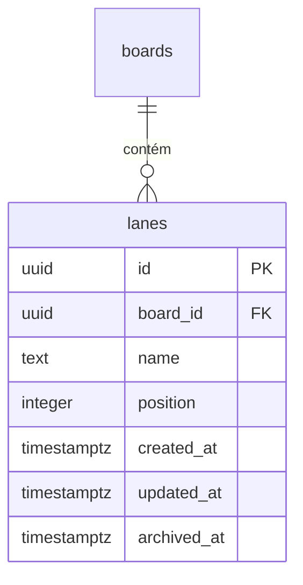
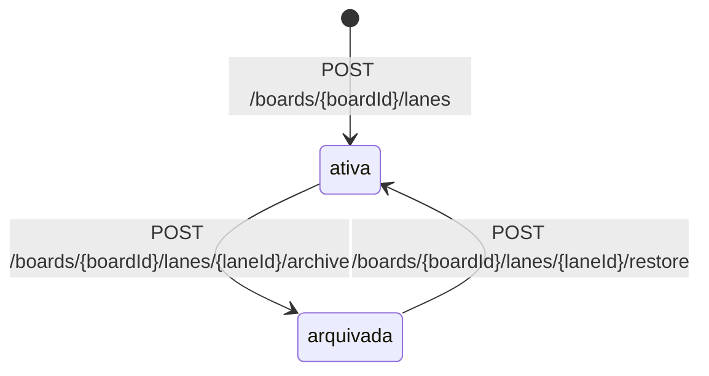

## Why

Um quadro não tem onde dividir o trabalho em etapas. Sem lanes ordenadas dentro do quadro, não há onde pendurar card.

## What Changes

- `POST /boards/{boardId}/lanes` recebe `name` e responde `201` com `id`, `name`, `position`, `created_at`, `updated_at` e `archived_at`. A lane nasce ativa, na última posição do quadro.
- `name` é obrigatório e não vazio, com no máximo 100 caracteres, e pode repetir dentro do mesmo quadro. Entrada inválida responde `400`.
- As lanes ativas de um quadro têm `position` de `0` a `n - 1`, sem buraco e sem repetição, inclusive sob requisições simultâneas no mesmo quadro. Lane arquivada tem `position` `null`.
- `GET /boards/{boardId}/lanes` responde `200` com as lanes do quadro: as ativas por `position` crescente, seguidas das arquivadas por `archived_at` da mais recente para a mais antiga. `archived=false` restringe às ativas e `archived=true` às arquivadas; valor fora desses dois responde `400`.
- `PUT /boards/{boardId}/lanes/{laneId}` substitui `name`, com as regras de validação do `POST`, e responde `200` com a lane, ativa ou arquivada.
- `POST /boards/{boardId}/lanes/{laneId}/archive` carimba `archived_at`, grava `null` em `position` e desce uma posição as ativas que estavam acima dela. `POST /boards/{boardId}/lanes/{laneId}/restore` grava `null` em `archived_at` e põe a lane na última posição. Os dois respondem `200` com a lane; arquivar lane arquivada ou restaurar lane ativa responde `200` sem alterar a lane.
- `PUT /boards/{boardId}/lanes/order` recebe `lane_ids` com os ids das lanes ativas na nova ordem, grava em cada uma a `position` igual ao índice na lista e responde `200` com as lanes ativas na nova ordem. `lane_ids` ausente, com elemento `null` ou com id repetido responde `400`; lista cujo conjunto difere das lanes ativas do quadro responde `409`.
- Quadro inexistente ou de outra conta responde `404` em todo endpoint de lane, com o mesmo corpo de quadro inexistente. Lane inexistente ou de outro quadro responde `404` em `PUT`, `archive` e `restore`.
- Quadro arquivado aceita todas as operações de lane.
- `updated_at` da lane muda quando `name` ou `archived_at` muda. Mudança de `position` não carimba `updated_at`, e requisição que não muda nenhum valor deixa `updated_at` intacto.
- Excluir a linha do quadro em `boards` apaga as lanes dele.
- Os endpoints de lane aparecem no documento OpenAPI com os códigos de resposta que produzem.

## Capabilities

### New Capabilities

- `lane-management`: criação, listagem, edição, arquivamento e reordenação das lanes de um quadro, com isolamento entre donos.

### Modified Capabilities

Nenhuma.

## Impact

- Pacote novo `com.william.kanban.lane`, com `Lane`, `LaneRepository`, `LaneService`, `LaneController`, `LaneNotFoundException`, `LaneOrderMismatchException`, `LaneLimits` e os records `CreateLaneRequest`, `UpdateLaneRequest`, `ReorderLanesRequest` e `LaneResponse`.
- `BoardService` passa a ser pública, e `BoardRepository` ganha a consulta com trava pessimista por `id` e `owner_id`.
- Endpoints novos: `POST /boards/{boardId}/lanes`, `GET /boards/{boardId}/lanes`, `PUT /boards/{boardId}/lanes/{laneId}`, `POST /boards/{boardId}/lanes/{laneId}/archive`, `POST /boards/{boardId}/lanes/{laneId}/restore` e `PUT /boards/{boardId}/lanes/order`. Todos exigem token.
- Migration `V4__create_lanes.sql`: tabela `lanes`, chave estrangeira `board_id` para `boards (id)` com `ON DELETE CASCADE`, restrição única `(board_id, position)` `DEFERRABLE` e `CHECK ((archived_at IS NULL) = (position IS NOT NULL))`. `created_at` e `updated_at` são `NOT NULL` e não têm `DEFAULT`.
- `GlobalExceptionHandler` passa a converter `LaneNotFoundException` em `404` e `LaneOrderMismatchException` em `409`.
- `OpenApiResponsesConfig` passa a documentar o `409` de `PUT /boards/{boardId}/lanes/order`.
- Nenhuma dependência nova no `pom.xml`.
