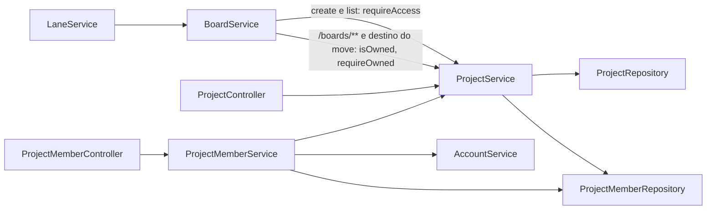
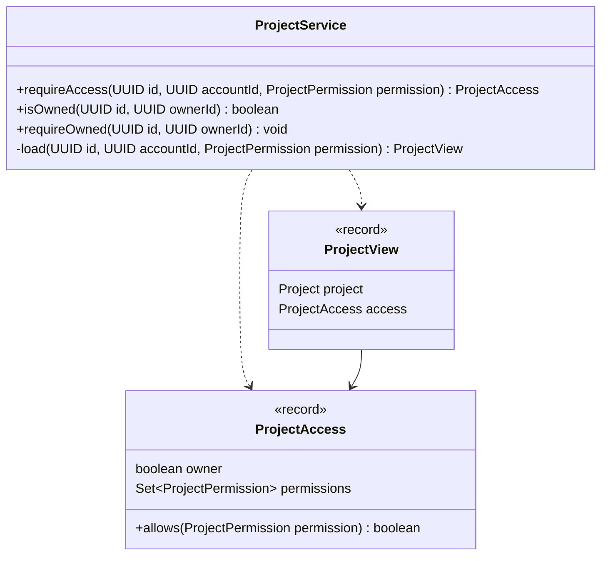
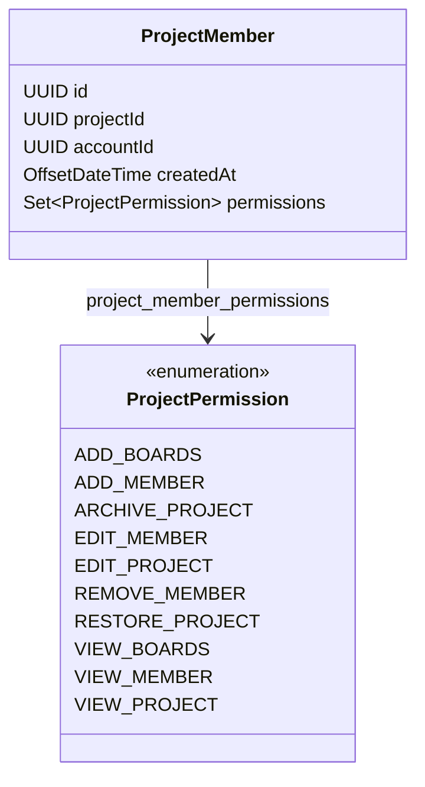
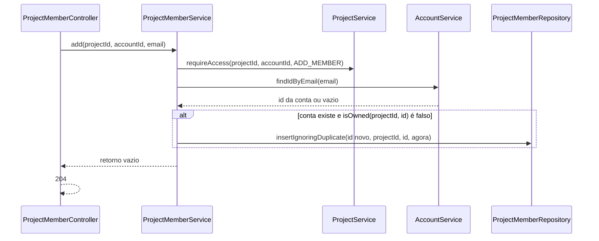
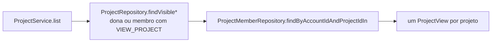

## Context

Ver `proposal.md`, seção Why, e as specs desta change para os comportamentos.

Restrições que moldam as decisões abaixo:

- `spring.jpa.open-in-view=false`: coleção lazy lida depois que o repositório devolve a entidade lança `LazyInitializationException`.
- `GlobalExceptionHandler.handleConflict` relança toda violação de restrição que não é `ux_accounts_email`, e a requisição termina em `500`.
- `OpenApiResponsesConfig.errorResponsesFromSignature` recebe só o `HandlerMethod`, sem o caminho da rota.
- `AccountService` é a única classe pública do pacote `account`.

## Goals / Non-Goals

**Goals:**

- Só `ProjectService` decide o que uma conta pode fazer num projeto, inclusive quando a pergunta chega pelo pacote `board`.
- O pacote `lane` não muda.

**Non-Goals:**

- Permissões por quadro.
- Transferência de dono.
- Convite para email sem conta.
- Paginação da listagem de membros.

## Decisions

### Pacotes e dependências

`ProjectService` fica com as operações de projeto e com a decisão de acesso; `ProjectMemberService`, package-private, com as operações de membro. O pacote `account` não importa nada de `project`.

### A decisão de acesso devolve ProjectAccess

`load` segue o fluxo de decisão da proposal: lê o projeto por `ProjectRepository.findById` e, quando `ownerId` difere da conta, o vínculo por `ProjectMemberRepository.findByProjectIdAndAccountId`. Projeto ausente ou conta sem vínculo lançam `ProjectNotFoundException`; `allows` falso lança `ProjectAccessDeniedException`. A dona recebe `ProjectAccess(true, Set.of())`, e `allows` responde verdadeiro para ela em qualquer permissão.

`requireAccess` devolve `load(...).access()`. `findById`, `update`, `archive` e `restore` de `ProjectService` usam `load` com a permissão do endpoint. `ProjectPermission`, `ProjectAccess` e `ProjectAccessDeniedException` são públicas, a exceção com construtor package-private.

Os services entregam ao controller o recurso junto com o `ProjectAccess`: `ProjectView` em `ProjectService.findById` e `list`, `ProjectBoards(List<Board> boards, ProjectAccess access)` em `BoardService.list`, `ProjectMemberView(ProjectMember member, AccountSummary account, ProjectAccess access)` na consulta de membro e `ProjectMembers(List<ProjectMemberView> members, ProjectAccess access)` na listagem.

### Links filtrados pelo ProjectAccess

| Assembler | Relação | Aparece quando |
|---|---|---|
| `ProjectModelAssembler` | `edit`, `archive`, `restore`, `boards`, `create-board`, `members`, `add-member` | `allows` da permissão do endpoint da relação; `archive` e `restore` também pelo `archived_at` |
| `BoardModelAssembler`, quadro | `project` | `allows(VIEW_PROJECT)` |
| `BoardModelAssembler`, quadro | `edit`, `archive`, `restore`, `move`, `lanes`, `create-lane`, `reorder-lanes` | `owner()` |
| `BoardModelAssembler`, listagem | `create-board` e `project` | `allows(ADD_BOARDS)` e `allows(VIEW_PROJECT)` |
| `ProjectMemberModelAssembler`, membro | `remove` e `edit-permissions` | `allows(REMOVE_MEMBER)` e `allows(EDIT_MEMBER)` |
| `ProjectMemberModelAssembler`, listagem | `add-member` e `project` | `allows(ADD_MEMBER)` e `allows(VIEW_PROJECT)` |

`self` aparece sempre. `GET /boards/{id}` só atende a dona, então `BoardController` passa `new ProjectAccess(true, Set.of())` ao assembler, e o quadro sai com os mesmos links do item listado para ela.

### Permissões numa coleção de enum

`permissions` é `@ElementCollection` sobre `project_member_permissions`, com `@Enumerated(EnumType.STRING)`: a coluna `permission` guarda o nome da constante, e o `CHECK` da `V7` lista esses nomes. Cada constante leva `@JsonProperty` com o valor em minúsculas das specs e é declarada na ordem alfabética desse valor; o assembler copia `permissions` para um `EnumSet`, que itera na ordem de declaração.

A coleção é lazy, então todo finder cujo resultado chega a `ProjectAccess` ou a uma resposta leva `@EntityGraph(attributePaths = "permissions")`. `PUT .../permissions` limpa e preenche o `Set` do membro carregado dentro da transação, e o flush reescreve as linhas da coleção.

### Adição sem violação de unicidade

`insertIgnoringDuplicate` é `INSERT ... ON CONFLICT (project_id, account_id) DO NOTHING` nativo, com `id` e `created_at` gerados na JVM. Duas adições simultâneas do mesmo email respondem `204` sem passar pelo `handleConflict`. `ProjectMember.createdAt` é mapeado com `insertable = false, updatable = false`, e a entidade não tem construtor além do protegido do JPA.

`AccountService.findIdByEmail(String)` converte o email para minúsculas. `AccountService.summariesOf(Collection<UUID>)` lê as contas por `findAllById` e devolve `Map<UUID, AccountSummary>`, com `AccountSummary(UUID id, String email, String displayName)` público. `Account` continua package-private.

Nos endpoints com `{memberId}`, `ProjectMemberService` chama `requireAccess` antes de `ProjectMemberRepository.findByIdAndProjectId`, e o vazio lança `ProjectMemberNotFoundException`.

### Listagem de projetos visíveis

`ProjectRepository` troca os três finders por `owner_id` por três `@Query` JPQL com a mesma cláusula de visibilidade, um por ramo de `archived`, e perde `findByIdAndOwnerId`. Os vínculos da conta com os projetos listados vêm numa consulta só, e o `ProjectAccess` de cada projeto sai da comparação de `ownerId` com a conta.

### 403 no ProblemDetail e no OpenAPI

`GlobalExceptionHandler` converte `ProjectAccessDeniedException` em `403` com a mensagem da exceção, e `ProjectMemberNotFoundException` entra no `handleNotFound`. `errorResponsesFromSignature` acrescenta `403` quando o handler tem `@PathVariable` com nome de parâmetro `projectId`; o nome vem do `-parameters` que o parent POM liga no compilador. `POST /boards/{id}/move` e as rotas de lane ficam sem `403`.

## Risks / Trade-offs

**Risco:** a permissão é lida antes da escrita, sem trava; um `PUT .../permissions` que retira `edit_project` durante um `PUT /projects/{projectId}` do mesmo membro não impede a edição.
**Mitigação:** nenhuma.

**Risco:** a coluna `permission` guarda o nome da constante de `ProjectPermission`, e renomear a constante deixa linhas que o Hibernate não converte.
**Mitigação:** o `CHECK` da `V7` recusa o nome novo até uma migration renomear as linhas.

**Risco:** `POST /projects/{projectId}/members` só executa a inserção quando o email tem conta, e o tempo de resposta distingue email cadastrado de email sem conta.
**Mitigação:** nenhuma.

**Risco:** o `or exists` da cláusula de visibilidade impede o uso isolado de `ix_projects_owner_id`, e `GET /projects` percorre `projects` inteira.
**Mitigação:** `ix_project_members_account_id` reduz a subconsulta a uma busca por índice.

## Migration Plan

`V7__create_project_members.sql` só cria tabelas e se aplica sobre o Postgres de desenvolvimento sem zerar o banco. O rollback é uma migration nova com `DROP TABLE project_member_permissions` e `DROP TABLE project_members`.
