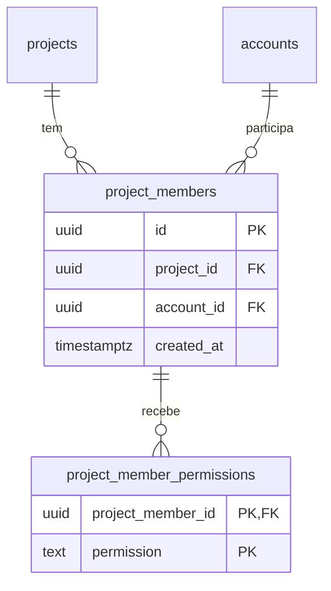
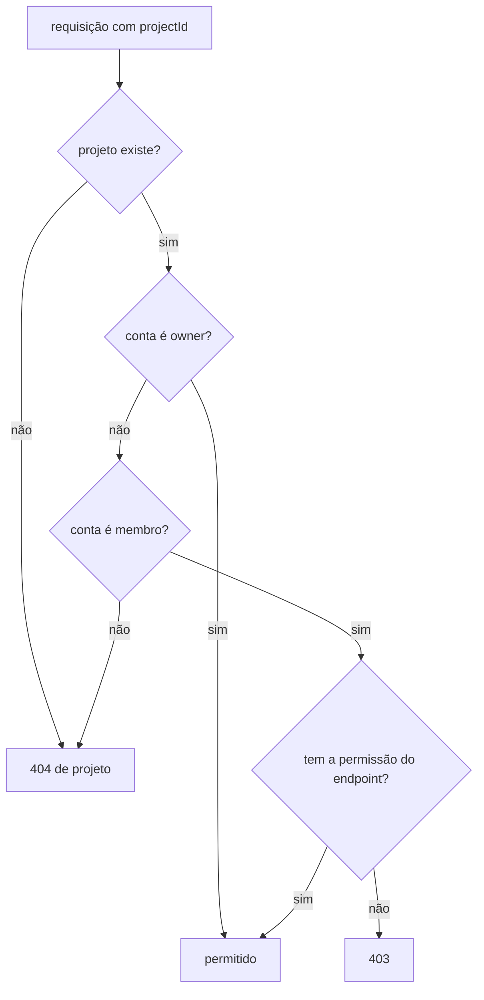

## Why

Um projeto só é acessível à conta dona. Não há como outra conta participar dele, nem como limitar o que essa conta pode fazer.

## What Changes

| Endpoint | Permissão do membro |
|---|---|
| `GET /projects/{projectId}` | `view_project` |
| `PUT /projects/{projectId}` | `edit_project` |
| `POST /projects/{projectId}/archive` | `archive_project` |
| `POST /projects/{projectId}/restore` | `restore_project` |
| `POST /projects/{projectId}/members` | `add_member` |
| `GET /projects/{projectId}/members` | `view_member` |
| `GET /projects/{projectId}/members/{memberId}` | `view_member` |
| `DELETE /projects/{projectId}/members/{memberId}` | `remove_member` |
| `PUT /projects/{projectId}/members/{memberId}/permissions` | `edit_member` |
| `POST /projects/{projectId}/boards` | `add_boards` |
| `GET /projects/{projectId}/boards` | `view_boards` |

- As permissões são `add_member`, `remove_member`, `view_member`, `edit_member`, `view_project`, `edit_project`, `archive_project`, `restore_project`, `add_boards` e `view_boards`. Nenhuma implica outra.
- O owner do projeto não é membro e atende todo endpoint da tabela sem permissão.
- `POST /projects/{projectId}/members` recebe `email` e responde `204` sem corpo. Email de conta existente, sem vínculo com o projeto e diferente do owner vira membro sem nenhuma permissão; email sem conta, do owner ou de membro atual responde `204` sem gravar nada. O email é comparado em minúsculas. `email` ausente, vazio ou fora do formato de email responde `400`.
- `GET /projects/{projectId}/members` responde `200` com os membros em `_embedded.members`, por `created_at` do mais recente para o mais antigo.
- O membro traz `id`, `account_id`, `email`, `display_name`, `permissions` e `created_at`. `email` e `display_name` vêm da conta; `permissions` é um array em ordem alfabética.
- `PUT /projects/{projectId}/members/{memberId}/permissions` recebe `permissions`, substitui o conjunto inteiro e responde `200` só com `_links.self` do membro. Array vazio remove todas; valor repetido grava uma vez; `permissions` ausente, `null`, fora do formato de array, com item `null` ou com item fora da lista responde `400`.
- `DELETE /projects/{projectId}/members/{memberId}` apaga o membro e as permissões dele e responde `204`.
- O membro com `edit_member` altera as próprias permissões, e o membro com `remove_member` remove a si mesmo.
- `memberId` inexistente ou de outro projeto responde `404` de membro.
- `GET /projects` traz os projetos da conta e os projetos em que ela é membro com `view_project`, com a mesma ordem e o mesmo filtro `archived`.
- `_links` do projeto traz só as relações dos endpoints que a conta pode chamar. `members` e `add-member` entram como relações novas.
- `GET /boards/{id}`, `PUT /boards/{id}`, `POST /boards/{id}/archive`, `POST /boards/{id}/restore`, `POST /boards/{id}/move` e os endpoints de lane atendem só o owner; membro recebe `404` de quadro.
- O quadro em `_embedded.boards` e a listagem trazem em `_links` só `self` e as relações dos endpoints que a conta pode chamar.
- `_links` do membro traz `self`, `remove` e `edit-permissions`, também filtrados pelas permissões da conta.
- Apagar a linha da conta em `accounts` ou do projeto em `projects` apaga os membros ligados a ela.
- Os endpoints de membro aparecem no documento OpenAPI, e todo endpoint com `{projectId}` lista a resposta `403`.

## Capabilities

### New Capabilities

- `project-membership`: adição, consulta e remoção de membros de um projeto e atribuição das permissões de projeto a cada membro.

### Modified Capabilities

- `project-management`: membro com a permissão do endpoint acessa o projeto, membro sem ela recebe `403`, a listagem inclui os projetos com `view_project` e os links do projeto dependem das permissões da conta.
- `board-management`: membro com `add_boards` cria e membro com `view_boards` lista os quadros do projeto, membro sem a permissão recebe `403`, e os links do quadro e da listagem dependem das permissões da conta.
- `api-hypermedia`: a coleção `_embedded.members` e a escrita `PUT /projects/{projectId}/members/{memberId}/permissions` seguem o formato HAL.

## Impact

- Pacote `project`: entram `ProjectMember`, `ProjectMemberRepository`, `ProjectMemberService`, `ProjectMemberController`, `ProjectMemberModelAssembler`, `ProjectPermission`, `ProjectMemberNotFoundException`, `ProjectAccessDeniedException` e os records `ProjectAccess`, `ProjectView`, `ProjectMemberView`, `ProjectMembers`, `AddProjectMemberRequest`, `UpdateProjectMemberPermissionsRequest` e `ProjectMemberResponse`. `ProjectService`, `ProjectController` e `ProjectModelAssembler` passam a decidir e montar pela conta e suas permissões.
- Pacote `board`: `BoardService.create` e `BoardService.list` conferem `add_boards` e `view_boards` pelo `ProjectService`, `BoardModelAssembler` monta os links pelas permissões da conta, e entra o record `ProjectBoards`.
- Pacote `account`: `AccountService` expõe `findIdByEmail` e `summariesOf`, e entra o record público `AccountSummary`.
- Endpoints novos: `POST /projects/{projectId}/members`, `GET /projects/{projectId}/members`, `GET /projects/{projectId}/members/{memberId}`, `DELETE /projects/{projectId}/members/{memberId}` e `PUT /projects/{projectId}/members/{memberId}/permissions`. Todos exigem token.
- Migration `V7__create_project_members.sql`: tabela `project_members`, com chaves estrangeiras para `projects (id)` e `accounts (id)` com `ON DELETE CASCADE` e restrição única `(project_id, account_id)`; tabela `project_member_permissions`, com chave primária `(project_member_id, permission)`, chave estrangeira para `project_members (id)` com `ON DELETE CASCADE` e `CHECK` restringindo `permission` às dez permissões.
- `GlobalExceptionHandler` converte `ProjectMemberNotFoundException` em `404` e `ProjectAccessDeniedException` em `403`.
- `OpenApiResponsesConfig` documenta `403` nos endpoints com `{projectId}`.
- Nenhuma dependência nova no `pom.xml`.
