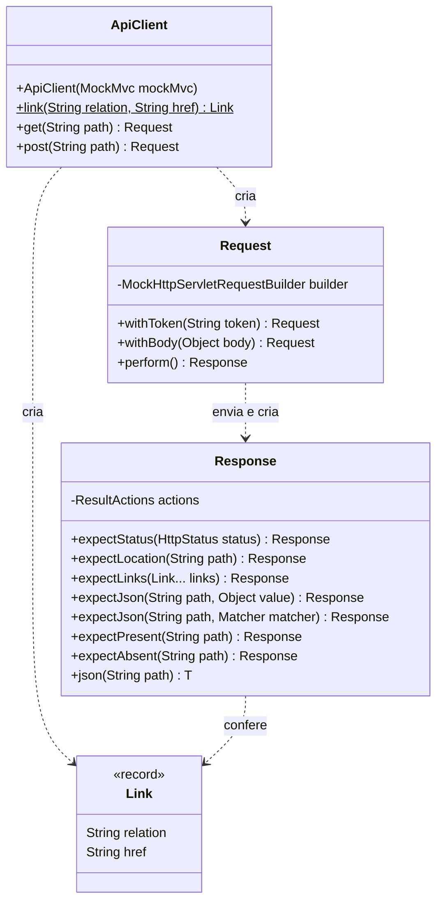
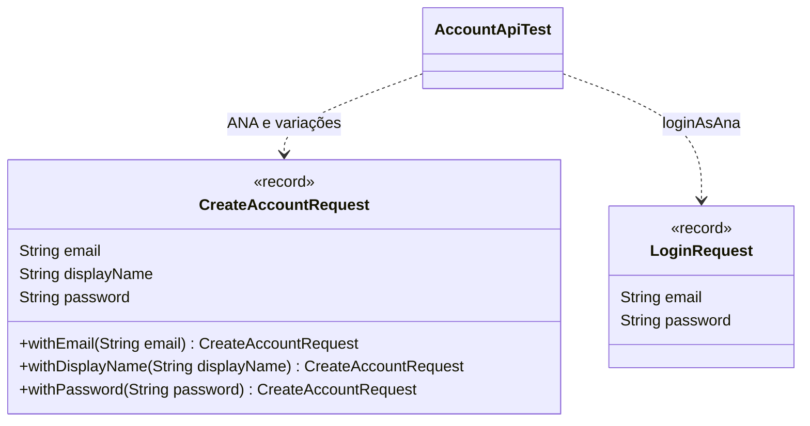
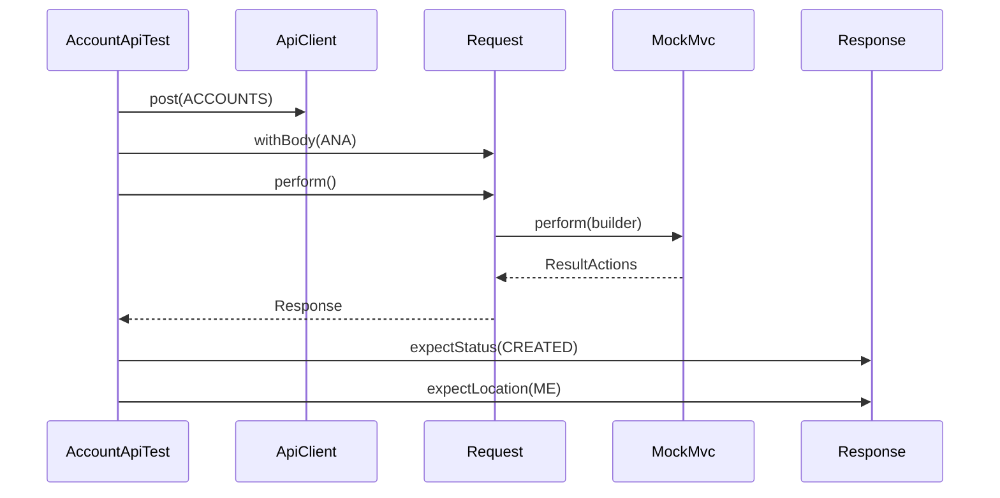

## Context

Ver `proposal.md`, seção Why.

Restrições que moldam as decisões abaixo:

- `MockMvc.perform`, `ResultActions.andExpect` e `MockHttpServletResponse.getContentAsString` declaram exceção checada, e a verificação que falha lança `AssertionError`, que não é `Exception`.
- A lista de `@Import` e as anotações da classe de teste compõem a chave do cache de contexto do Spring: bean de teste registrado só no `AccountApiTest` sobe um contexto e um container Postgres a mais.
- `_links` traz relação com hífen, como `create-lane`, que o JsonPath só lê na notação `['...']`.
- O build roda no JDK 26, cujo javac não executa processador de anotação encontrado só no classpath.
- JaCoCo e PIT ignoram método anotado com `@Generated` de retenção `CLASS` ou `RUNTIME`.

## Goals / Non-Goals

**Goals:**

- `ApiClient` não conhece recurso da API: caminho, corpo e valores esperados vêm do teste.

**Non-Goals:**

- Migração de `AuthApiTest`, `RootApiTest`, `ProjectApiTest`, `ProjectMemberApiTest`, `BoardApiTest` e `LaneApiTest`.
- Fixtures compartilhadas entre classes de teste.
- `put`, `delete` e parâmetro de query.
- Consulta ao banco por `AccountRepository` no teste.

## Decisions

### Estrutura

`Request` e `Response` são classes `public static final` aninhadas em `ApiClient`, com construtor privado, e `Link` é record aninhado. Cada método de verificação chama `andExpect` no `ResultActions` e devolve o próprio `Response`. `withBody` serializa o corpo com um `JsonMapper` estático do `ApiClient`.

### Corpo da requisição pelos records de src/main

`CreateAccountRequest` leva `@With` e `@JsonInclude(NON_NULL)`: `ANA.withEmail(null)` envia o corpo sem `email`. `LoginRequest` é público porque o `AccountApiTest` fica no pacote `account`. Renomear uma propriedade JSON do record muda junto o corpo que o teste envia, e o `documentsAccountEndpoints` segue conferindo `display_name` no schema de `CreateAccountRequest`.

### A requisição sai em perform

`expect...` antes de `perform()` não compila, e requisição sem verificação de status é permitida.

### Exceção checada

`Exception` lançada por `perform`, `andExpect` ou `getContentAsString` sai como `IllegalStateException` com a original na causa. O `catch` pega `Exception`, nunca `Throwable`, e o `AssertionError` chega ao JUnit sem embrulho.

### expectLinks

Recebe um `Link` por relação, criado por `ApiClient.link`, que o teste importa estaticamente. Confere `$._links` com `aMapWithSize` do número de links e cada `$._links['<relação>'].href` com o `href` do link. `Link` fica aninhado para não colidir com `org.springframework.hateoas.Link`.

### Instância por classe de teste

`AccountApiTest` mantém `@Autowired MockMvc` e cria o `ApiClient` no campo `api`, no `@BeforeEach`. `ApiClient` não é bean, e o contexto em cache é o mesmo das outras classes de teste.

### Lombok opcional

O Lombok entra como dependência `optional`, com o processador em `annotationProcessorPaths` da configuração do `maven-compiler-plugin`, que vale para `src/main` e `src/test`, e fora do jar pelo `excludes` do `spring-boot-maven-plugin`. O `lombok.config` na raiz liga `lombok.addLombokGeneratedAnnotation`, e os `with...` gerados ficam fora da cobertura do JaCoCo e dos mutantes do PIT.

### Constantes do AccountApiTest

Caminho e corpo repetidos em mais de um teste viram constante: `ACCOUNTS`, `ME`, `LOGIN` e `ANA`, que é o `CreateAccountRequest` de email `"ana@exemplo.com"`, display_name `"Ana"` e password `"segredo"`. Valor usado uma vez fica literal no teste.

## Risks / Trade-offs

- [Cadeia que termina em `with...` sem `perform()` não envia a requisição, e o teste passa sem falar com a API] → a última task compara o número de mutantes mortos com a linha de base, e verificação perdida derruba esse número.
