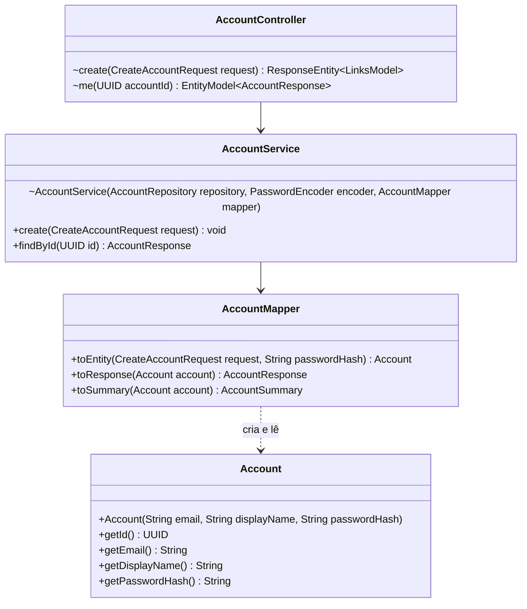
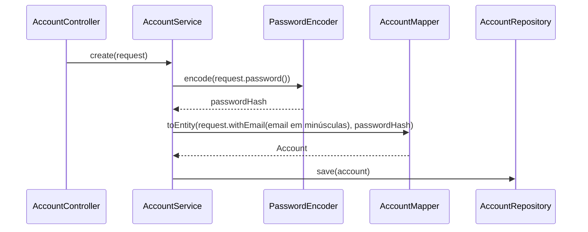

## Context

Ver `proposal.md`, seção Why.

Restrições que moldam as decisões abaixo:

- O build roda no JDK 26, e o parent 4.1.1 fixa a JUnit Platform em 6.0.3. O ArchUnit 1.5.0 lê class file do JDK 26, e o engine dele roda nessa plataforma ao lado do `pitest-junit5-plugin` 1.2.3.
- O `AccountServiceTest` injeta `AccountRepository`, e o `AccountApiTest` fica no pacote `controller`: importadas pelo ArchUnit, as classes de teste violam as regras de camada.

## Goals / Non-Goals

**Goals:**

- `authenticate`, `findIdByEmail` e `summariesOf` mantêm parâmetros e retorno: `AuthService` e `ProjectMemberService` só trocam o import.

**Non-Goals:**

- Regra de acesso de `repository`, `entity`, `dto` e `exception` a outras camadas.

## Decisions

### Tipos que mudam de assinatura

`me` devolve `EntityModel.of(service.findById(accountId), ...)` com os mesmos links. `findById` converte por `repository.findById(id).map(mapper::toResponse)` e lança `AccountNotFoundException` no vazio. `summariesOf` monta o mapa com `toMap(Account::getId, mapper::toSummary)`.

### Criação da conta

O email vai para minúsculas com `Locale.ROOT`, igual a `authenticate` e `findIdByEmail`. O `withEmail` é o gerado pelo `@With` do `CreateAccountRequest`.

### ArchitectureTest

`@AnalyzeClasses(packages = "com.william.kanban", importOptions = ImportOption.DoNotIncludeTests.class)`, com um campo `@ArchTest static final ArchRule` por regra da proposal. Cada pacote de camada é uma constante `com.william.kanban.<camada>..`.

| Campo | Regra |
|---|---|
| `controllerOnlyAccessesServiceAndDto` | `layers().whereLayer("Controller").mayOnlyAccessLayers("Service", "Dto")` |
| `serviceOnlyAccessesItsLayers` | `layers().whereLayer("Service").mayOnlyAccessLayers("Repository", "Mapper", "Entity", "Dto", "Exception")` |
| `mapperOnlyAccessesEntityAndDto` | `layers().whereLayer("Mapper").mayOnlyAccessLayers("Entity", "Dto")` |
| `entityAndRepositoryStayBehindService` | `noClasses().that().resideOutsideOfPackages(SERVICE, REPOSITORY, MAPPER).should().dependOnClassesThat().resideInAnyPackage(ENTITY, REPOSITORY)` |
| `onlyAccountServiceReadsPasswordHash` | `noClasses().that().doNotHaveFullyQualifiedName(AccountService.class.getName()).should().callMethod(Account.class, "getPasswordHash")` |

`layers()` é um método estático privado que devolve `layeredArchitecture().consideringOnlyDependenciesInLayers()` com as sete camadas definidas. Nas três regras de camada, dependência para `shared`, Spring ou JDK fica fora da verificação. Na quarta, a referência de `Account` a si mesma não conta como dependência.

### Dependência

`com.tngtech.archunit:archunit-junit5` na versão `${archunit.version}`, com a propriedade `archunit.version` em `1.5.0` junto de `pitest.version` e `jacoco.version`.

### Testes

`AccountServiceTest` recebe `AccountMapper` por `@Autowired` e constrói `new AccountService(repository, encoder, mapper)`.

`AccountsTableTest` leva `@SpringBootTest` e `@Import(TestcontainersConfiguration.class)`, as mesmas anotações do `AccountServiceTest`, e usa o contexto em cache dele. O `databaseRejectsEmailNotNormalized` grava a linha por `JdbcTemplate`, sem passar pelo `AccountRepository`.

Os arquivos saem de `account/` por `git mv`, e `git log --follow` mantém o histórico de cada um.

## Risks / Trade-offs

- [O engine do ArchUnit não é descoberto e o `ArchitectureTest` some da contagem sem falhar o build] → a task que roda o `ArchitectureTest` confere cinco testes na saída do Surefire.
- [Um campo copiado pelo `AccountMapper` fica sem verificação nos testes de API] → a última task compara o número de mutantes mortos com a linha de base.
