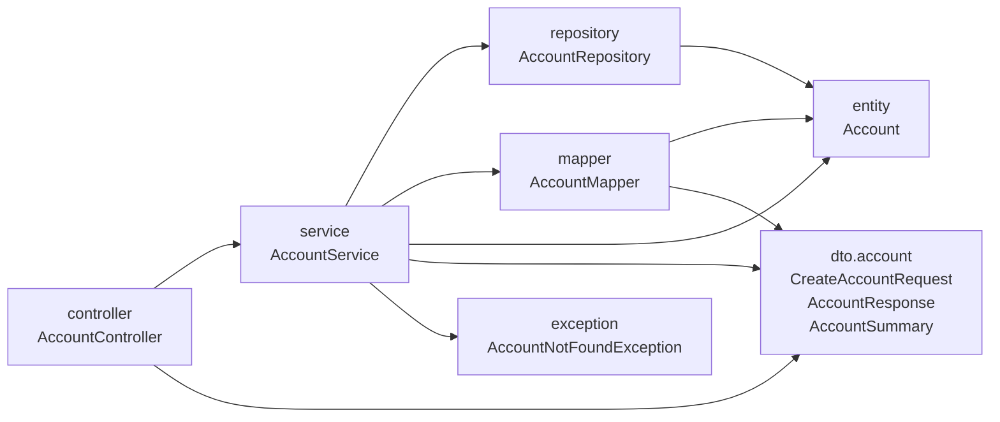

## Why

O pacote `com.william.kanban.account` junta entidade, repositório, serviço, controller, records de JSON e exceção. Não há um lugar único para cada responsabilidade: a conversão entre `Account` e os records se divide entre `AccountController` e `AccountService`, e nenhum teste falha quando uma classe acessa uma responsabilidade que não devia.

## What Changes

- Os pacotes do diagrama ficam sob `com.william.kanban`, e `dto` tem um subpacote por feature.
- `AccountMapper` é `@Component` com `toResponse(Account)`, `toSummary(Account)` e `toEntity(CreateAccountRequest, String passwordHash)`, e toda conversão entre `Account` e os records de `dto.account` passa por ele.
- O email em minúsculas e o hash BCrypt da senha ficam no `AccountService`; o `AccountMapper` só copia valores já tratados.
- `AccountService` devolve records de `dto.account` e nunca `Account`: `findById` devolve `AccountResponse`, e `create` recebe `CreateAccountRequest`.
- `Account` com construtor e getters, `AccountRepository`, `AccountMapper`, `AccountService.create`, `AccountService.findById`, `CreateAccountRequest`, `AccountResponse` e o construtor de `AccountNotFoundException` passam a ser públicos. `AccountController` e o construtor de `AccountService` seguem package-private.
- `ArchitectureTest`, em `com.william.kanban` de `src/test`, usa ArchUnit e falha quando:
  - `controller` acessa pacote de camada que não seja `service` ou `dto`;
  - `service` acessa pacote de camada que não seja `repository`, `mapper`, `entity`, `dto` ou `exception`;
  - `mapper` acessa pacote de camada que não seja `entity` ou `dto`;
  - classe fora de `service`, `repository` e `mapper` acessa `entity` ou `repository`, inclusive de `auth` e `project`;
  - classe que não seja `AccountService` chama `Account.getPasswordHash`.
- Em `src/test`, `AccountApiTest` fica em `controller`, `AccountServiceTest` em `service` e `AccountsTableTest` em `schema`.
- `databaseRejectsEmailNotNormalized` fica no `AccountsTableTest`, com o mesmo corpo. Os demais testes mantêm nome e verificações.
- `AccountMapper` não tem classe de teste própria.

Fora desta change: `auth`, `project`, `board`, `lane`, `shared`.

## Capabilities

### New Capabilities

Nenhuma.

### Modified Capabilities

Nenhuma.

## Impact

- `src/main/java/com/william/kanban/account/` passa para `controller/AccountController.java`, `service/AccountService.java`, `repository/AccountRepository.java`, `entity/Account.java`, `dto/account/CreateAccountRequest.java`, `dto/account/AccountResponse.java`, `dto/account/AccountSummary.java` e `exception/AccountNotFoundException.java`, sob `src/main/java/com/william/kanban/`.
- Arquivos novos: `src/main/java/com/william/kanban/mapper/AccountMapper.java`, `src/test/java/com/william/kanban/ArchitectureTest.java` e `src/test/java/com/william/kanban/schema/AccountsTableTest.java`.
- `src/test/java/com/william/kanban/account/` passa para `controller/AccountApiTest.java` e `service/AccountServiceTest.java`, sob `src/test/java/com/william/kanban/`.
- Imports em `auth/AuthService.java`, `project/ProjectMemberService.java`, `project/ProjectMemberView.java` e `shared/GlobalExceptionHandler.java`.
- `pom.xml`: dependência `com.tngtech.archunit:archunit-junit5` com escopo `test`.
- `CLAUDE.md`, seções Estado do projeto, Stack e Convenções.
- `README.md`, seções Stack e Estrutura.
