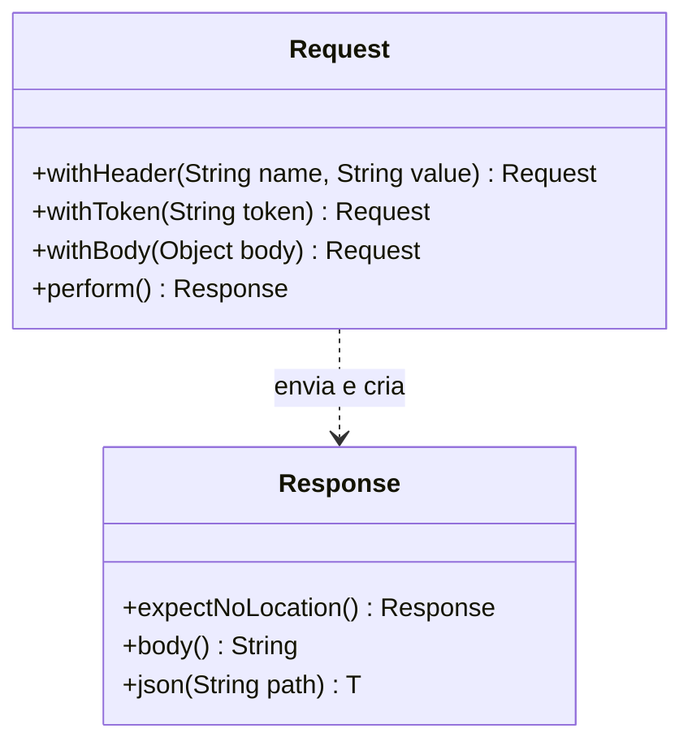

## Context

Ver `proposal.md`, seção Why.

Restrições que moldam as decisões abaixo:

- Os testes de header inválido enviam `Authorization` com esquema `Basic` e `Digest`, que o `withToken` não monta.
- `answersUnknownEmailWithTheSameBodyAsWrongPassword` compara o corpo inteiro de duas respostas.
- A change `refactor-auth-layered-packages` move `LoginRequest` para `dto.auth` e `AuthApiTest` para `controller` em outro worktree.

## Goals / Non-Goals

**Non-Goals:**

- Fixtures compartilhadas entre classes de teste.
- `put`, `delete` e parâmetro de query no `ApiClient`.

## Decisions

### Métodos novos do ApiClient

`withToken(token)` chama `withHeader(AUTHORIZATION, "Bearer " + token)`. `expectNoLocation` confere `header().doesNotExist(LOCATION)`. `body()` lê `getContentAsString` e embrulha a `UnsupportedEncodingException` em `IllegalStateException`, e `json(path)` passa a ler o corpo por `body()`.

### Verificações que mudam de forma

| MockMvc | ApiClient |
|---|---|
| `jsonPath(p).isNotEmpty()` | `expectJson(p, not(emptyOrNullString()))` |
| `jsonPath(p).value(v)` | `expectJson(p, v)` |
| `jsonPath(p).exists()` | `expectPresent(p)` |
| `jsonPath(p).doesNotExist()` | `expectAbsent(p)` |
| `jsonPath("$._links", aMapWithSize(n))` e um `href` por relação | `expectLinks(link(...), ...)` |
| `header().doesNotExist(LOCATION)` | `expectNoLocation()` |
| `header(AUTHORIZATION, "Bearer " + t)` | `withToken(t)` |
| `header(AUTHORIZATION, outro)` | `withHeader(AUTHORIZATION, outro)` |

### Corpo pelo LoginRequest

`LoginRequest` leva `@With` e `@JsonInclude(NON_NULL)`, com os mesmos imports do `CreateAccountRequest`. `rejectsPayloadWithRequiredFieldMissingOrBlank` troca o `@ValueSource` por `@MethodSource("incompleteLogins")`, que devolve `ANA_LOGIN.withEmail(null)`, `ANA_LOGIN.withPassword(null)`, `ANA_LOGIN.withEmail("")` e `ANA_LOGIN.withPassword("")`.

### Constantes e helpers do AuthApiTest

| Nome | Valor |
|---|---|
| `LOGIN` | `"/auth/login"` |
| `LOGOUT` | `"/auth/logout"` |
| `ME` | `"/accounts/me"` |
| `ACCOUNTS` | `"/accounts"` |
| `ANA` | `CreateAccountRequest` de `"ana@exemplo.com"`, `"Ana"`, `"segredo"` |
| `ANA_LOGIN` | `LoginRequest` de `"ana@exemplo.com"`, `"segredo"` |

Os helpers ficam `createAccount(CreateAccountRequest)`, que devolve o id lido por `JdbcTemplate`, `createAna()`, que chama `createAccount(ANA)`, e `tokenOf(LoginRequest)`, que envia o login, confere `CREATED` e devolve `json("$.token")`. A conta de Bruno é `ANA.withEmail("bruno@exemplo.com").withDisplayName("Bruno").withPassword("outra")`, e cada login com outro valor é `ANA_LOGIN.with...`.

### RootApiTest

`expectAnonymousLinks` recebe `ApiClient.Response` e confere `OK`, `$` com um campo e `expectLinks` com `self`, `login` e `create-account`. `tokenOfAna` cria a conta por `CreateAccountRequest` e faz login por `LoginRequest`, com os mesmos valores do `AuthApiTest`. O `@ValueSource` de `linksEntryPointAsAnonymousForUnacceptedHeader` continua com os dois valores de header, enviados por `withHeader`.

## Risks / Trade-offs

- [Cadeia que termina em `with...` sem `perform()` não envia a requisição, e o teste passa sem falar com a API] → a última task compara o número de mutantes mortos com a linha de base.
- [`refactor-auth-layered-packages` move `LoginRequest` e `AuthApiTest` no outro worktree] → as duas branches só trocam `package` e imports nesses arquivos de um lado e o conteúdo do outro, e o merge da segunda passa pela detecção de renomeação do git.
