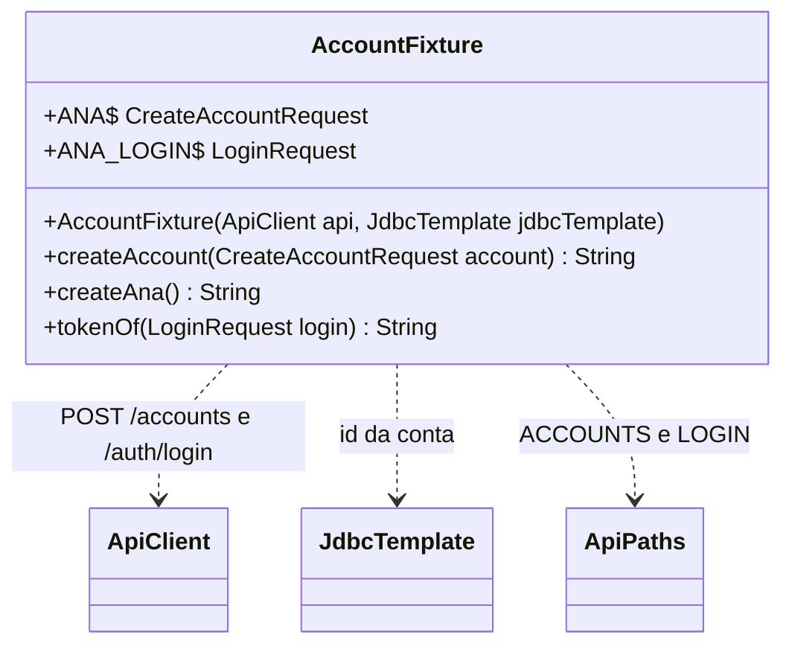
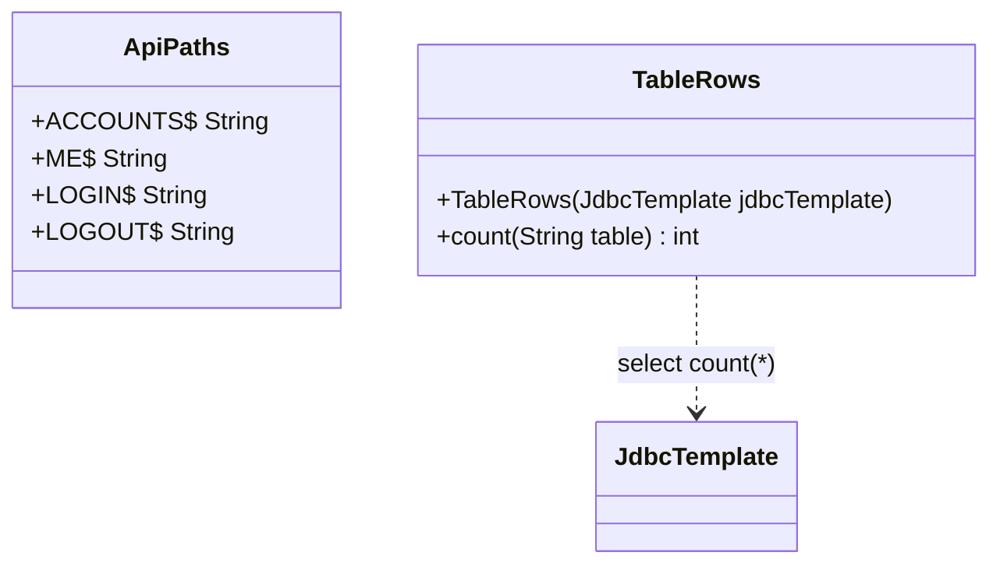

## Context

Ver `proposal.md`, seção Why.

Restrições que moldam as decisões abaixo:

- A change parte de uma `main` que já tem a change `refactor-auth-api-tests`: `AuthApiTest` e `RootApiTest` falam com a API pelo `ApiClient`, e `LoginRequest` leva `@With`.
- `ApiClient` registrado como bean por `@Import` muda a chave do cache de contexto, e o mesmo vale para qualquer classe de `support`.
- `LoginRequest` entra na `AccountFixture` pelo pacote em que estiver na `main` no início da implementação.

## Goals / Non-Goals

**Non-Goals:**

- Fixture de projeto, quadro, lane ou membro.
- Conta criada por `JdbcTemplate`, sem passar pela API.

## Decisions

### Forma da AccountFixture

A classe é `final` e não é bean: cada classe de teste a cria no `@BeforeEach`, no campo `accounts`, depois do `ApiClient`. As constantes entram nos testes por import estático.

| Membro | Valor ou comportamento |
|---|---|
| `ANA` | `CreateAccountRequest` de `"ana@exemplo.com"`, `"Ana"`, `"segredo"` |
| `ANA_LOGIN` | `LoginRequest` de `"ana@exemplo.com"`, `"segredo"` |
| `createAccount(account)` | envia `POST /accounts`, confere `CREATED` e devolve o id lido por `JdbcTemplate` pelo `account.email()` |
| `createAna()` | `createAccount(ANA)` |
| `tokenOf(login)` | envia `POST /auth/login`, confere `CREATED` e devolve `json("$.token")` |

### Classes de suporte genéricas

As duas ficam em `com.william.kanban.support` e são `final`.

| Classe | Forma |
|---|---|
| `ApiPaths` | sem instância; constantes `ACCOUNTS` = `"/accounts"`, `ME` = `"/accounts/me"`, `LOGIN` = `"/auth/login"` e `LOGOUT` = `"/auth/logout"`, que os testes e a `AccountFixture` usam por import estático |
| `TableRows` | não é bean; cada classe de teste a cria no `@BeforeEach`, no campo `rows`, a partir do `JdbcTemplate`; `count(table)` devolve o resultado de `select count(*) from <table>` |

### Helpers que saem dos testes

| Teste | Sai | Chamada nova |
|---|---|---|
| `AccountApiTest` | `ACCOUNTS`, `ME`, `LOGIN`, `ANA`, `createAna`, `loginAsAna`, `countAccounts` | `accounts.createAna()`, `accounts.tokenOf(ANA_LOGIN)`, `rows.count("accounts")` |
| `AuthApiTest` | `LOGIN`, `LOGOUT`, `ME`, `ACCOUNTS`, `ANA`, `ANA_LOGIN`, `createAccount`, `createAna`, `tokenOf`, `countTokens` | `accounts.createAccount(...)`, `accounts.createAna()`, `accounts.tokenOf(...)`, `rows.count("auth_tokens")` |
| `RootApiTest` | `tokenOfAna` | `accounts.createAna()` seguido de `accounts.tokenOf(ANA_LOGIN)` |

A contagem de `auth_tokens` filtrada por `token_hash` fica no `AuthApiTest`.

## Risks / Trade-offs

- [Chamada à fixture que cria a conta sem conferir o status mascara falha de criação] → `createAccount` e `tokenOf` conferem `CREATED` antes de devolver, e a última task compara o número de mutantes mortos com a linha de base.
