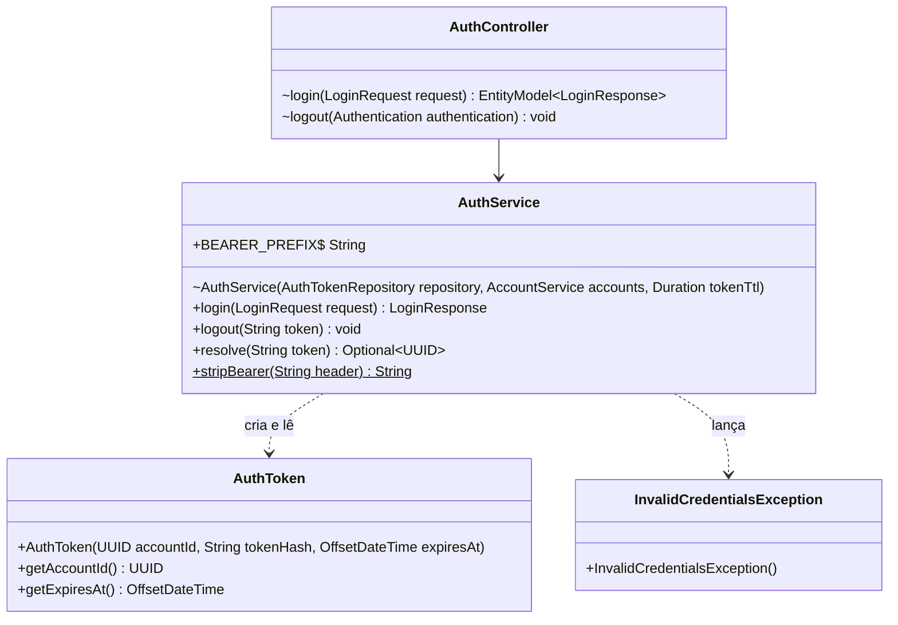
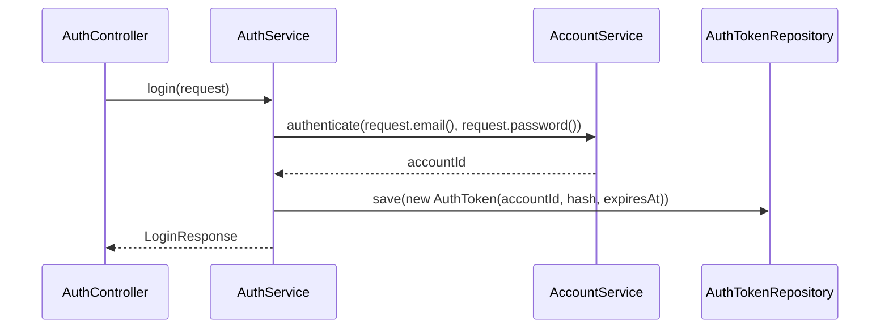

## Context

Ver `proposal.md`, seção Why.

Restrições que moldam as decisões abaixo:

- `BearerAuthenticationFilter` lê `BEARER_PREFIX` e chama `stripBearer` e `resolve` do `AuthService`, e passa a ficar em outro pacote.
- O valor do token só existe no `login`: `auth_tokens` guarda o hash, e `AuthToken` não tem de onde tirar o token para um mapper.
- A change `refactor-auth-api-tests` reescreve `AuthApiTest` e `LoginRequest` em outro worktree.

## Goals / Non-Goals

**Goals:**

- `resolve` e `logout` mantêm parâmetros e retorno: `BearerAuthenticationFilter` e `AuthController` só trocam o import nessas chamadas.

**Non-Goals:**

- Mapper para `AuthToken`.
- Regra de acesso de outras camadas a `security`.

## Decisions

### Tipos que mudam de assinatura

`login` monta `new LoginResponse(value, "Bearer", expiresAt)` no lugar do `IssuedToken`, e `AuthController.login` passa o request inteiro ao service. O construtor protegido de `AuthToken` segue `protected`.

### Login

### ArchitectureTest

`layers()` ganha `.layer("Security").definedBy(SECURITY)`, com a constante `SECURITY = "com.william.kanban.security.."`, e o teste ganha um campo:

| Campo | Regra |
|---|---|
| `securityOnlyAccessesService` | `layers().whereLayer("Security").mayOnlyAccessLayers("Service")` |

Nas regras de `Controller`, `Service` e `Mapper`, `security` passa a contar como camada, e nenhuma delas a acessa.

### Testes

`AuthApiTest` e `SecurityConfigTest` saem de `auth/` por `git mv`, e `git log --follow` mantém o histórico de cada um. `AccountApiTest` importa `LoginRequest` de `com.william.kanban.dto.auth`.

## Risks / Trade-offs

- [O `ArchitectureTest` ganha o campo novo e o Surefire não o conta] → a task que roda o `ArchitectureTest` confere seis testes na saída.
- [`refactor-auth-api-tests` reescreve `AuthApiTest` e `LoginRequest` no outro worktree] → nesta change esses dois arquivos só mudam `package` e imports, e o merge da segunda branch passa pela detecção de renomeação do git.
