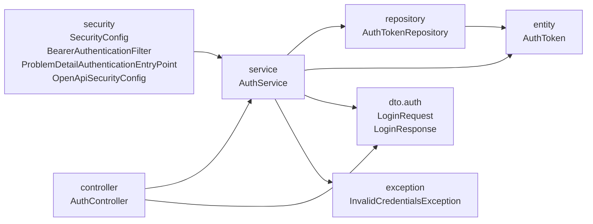

## Why

O pacote `com.william.kanban.auth` junta entidade, repositório, serviço, controller, records de JSON, exceção e a configuração do Spring Security. As regras do `ArchitectureTest` não alcançam nenhuma dessas classes, e `AuthToken` e `AuthTokenRepository` ficam acessíveis a qualquer classe do pacote.

## What Changes

- Os pacotes do diagrama ficam sob `com.william.kanban`, e o pacote `auth` deixa de existir.
- `AuthService.login` recebe `LoginRequest` e devolve `LoginResponse`, com `token_type` `"Bearer"`; `IssuedToken` deixa de existir.
- `AuthController.login` devolve `EntityModel.of(service.login(request), ...)` com os mesmos links.
- `AuthService` com `BEARER_PREFIX`, `login`, `logout`, `resolve` e `stripBearer`, `AuthToken` com construtor e getters, `AuthTokenRepository`, `LoginResponse` e o construtor de `InvalidCredentialsException` passam a ser públicos. `AuthController`, o construtor de `AuthService` e as classes de `security` seguem package-private.
- `ArchitectureTest` ganha a camada `Security`, definida por `com.william.kanban.security..`, e falha quando `security` acessa pacote de camada que não seja `service`.
- Em `src/test`, `AuthApiTest` fica em `controller` e `SecurityConfigTest` em `security`, e os dois mantêm nome e verificações; `SecurityConfigTest.rejectsProtectedRouteWithoutToken` confere também o `Content-Type` `application/problem+json`.
- Os arquivos movidos, exceto `AuthApiTest`, seguem as regras de formatação de Convenções do `CLAUDE.md`.

Fora desta change: `project`, `board`, `lane`, `shared`.

## Capabilities

### New Capabilities

Nenhuma.

### Modified Capabilities

Nenhuma.

## Impact

- `src/main/java/com/william/kanban/auth/` passa para `controller/AuthController.java`, `service/AuthService.java`, `repository/AuthTokenRepository.java`, `entity/AuthToken.java`, `dto/auth/LoginRequest.java`, `dto/auth/LoginResponse.java`, `exception/InvalidCredentialsException.java`, `security/SecurityConfig.java`, `security/BearerAuthenticationFilter.java`, `security/ProblemDetailAuthenticationEntryPoint.java` e `security/OpenApiSecurityConfig.java`, sob `src/main/java/com/william/kanban/`.
- Arquivo removido: `src/main/java/com/william/kanban/auth/IssuedToken.java`.
- `src/test/java/com/william/kanban/auth/` passa para `controller/AuthApiTest.java` e `security/SecurityConfigTest.java`, sob `src/test/java/com/william/kanban/`.
- Imports em `shared/GlobalExceptionHandler.java` e, em `src/test`, `controller/AccountApiTest.java`.
- `src/test/java/com/william/kanban/ArchitectureTest.java`.
- `CLAUDE.md`, seções Estado do projeto e Convenções.
- `README.md`, seção Estrutura.
