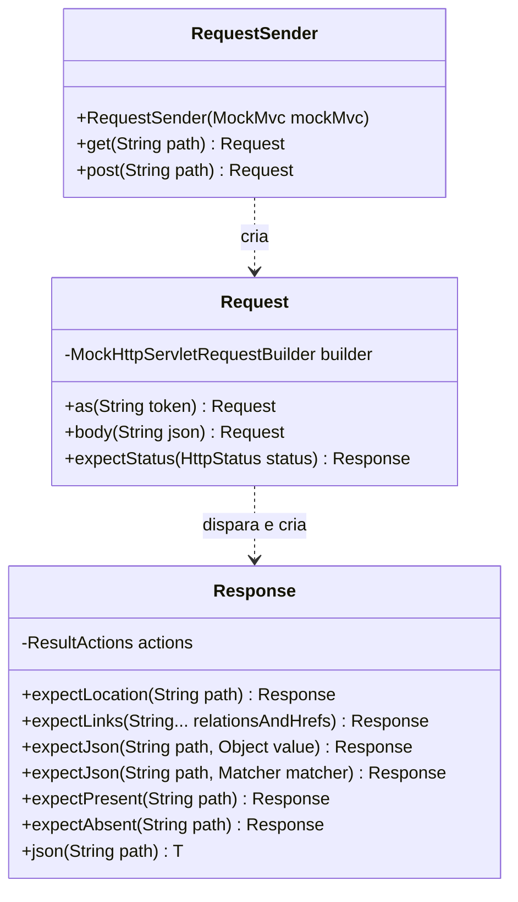
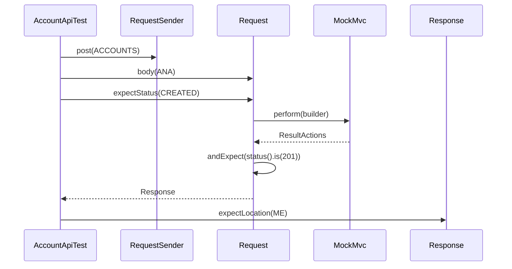

## Context

Ver `proposal.md`, seção Why.

Restrições que moldam as decisões abaixo:

- `MockMvc.perform`, `ResultActions.andExpect` e `MockHttpServletResponse.getContentAsString` declaram exceção checada, e a verificação que falha lança `AssertionError`, que não é `Exception`.
- A lista de `@Import` e as anotações da classe de teste compõem a chave do cache de contexto do Spring: bean de teste registrado só no `AccountApiTest` sobe um contexto e um container Postgres a mais.
- `_links` traz relação com hífen, como `create-lane`, que o JsonPath só lê na notação `['...']`.

## Goals / Non-Goals

**Goals:**

- `RequestSender` não conhece recurso da API: caminho, corpo e valores esperados vêm do teste.

**Non-Goals:**

- Migração de `AuthApiTest`, `RootApiTest`, `ProjectApiTest`, `ProjectMemberApiTest`, `BoardApiTest` e `LaneApiTest`.
- Fixtures compartilhadas entre classes de teste.
- `put`, `delete` e parâmetro de query.

## Decisions

### Estrutura

`Request` e `Response` são classes `public static final` aninhadas em `RequestSender`, com construtor privado. Cada método de verificação chama `andExpect` no `ResultActions` e devolve o próprio `Response`.

### A requisição sai em expectStatus

Toda requisição do teste passa por um status esperado.

### Exceção checada

`Exception` lançada por `perform`, `andExpect` ou `getContentAsString` sai como `IllegalStateException` com a original na causa. O `catch` pega `Exception`, nunca `Throwable`, e o `AssertionError` chega ao JUnit sem embrulho.

### expectLinks

Recebe pares de relação e `href`; número ímpar de argumentos lança `IllegalArgumentException`. Confere `$._links` com `aMapWithSize` do número de pares e cada `$._links['<relação>'].href` com o valor do par.

### Instância por classe de teste

`AccountApiTest` mantém `@Autowired MockMvc` e cria o `RequestSender` no `@BeforeEach`. `RequestSender` não é bean, e o contexto em cache é o mesmo das outras classes de teste.

### Constantes do AccountApiTest

Caminho e corpo repetidos em mais de um teste viram constante: `ACCOUNTS`, `ME`, `LOGIN` e `ANA`. Valor usado uma vez fica literal no teste.

## Risks / Trade-offs

- [Cadeia que não chega a `expectStatus` não envia a requisição, e o teste passa sem falar com a API] → a última task compara o número de mutantes mortos com a linha de base, e verificação perdida derruba esse número.
